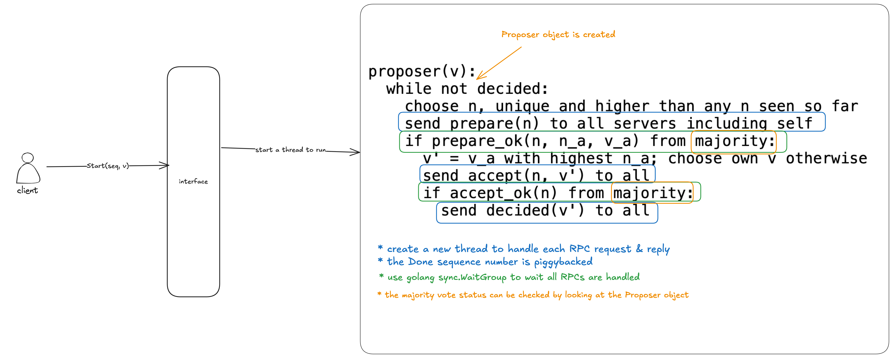

# Paxos

## Test Results

Videos: 

* Paxos Consensus Module: https://ty478.wistia.com/medias/unutii77tr
* Paxos-based Fault-tolerant Key/Value Store: https://ty478.wistia.com/medias/w7zrvexfy5

Runtime Specifications:

* CPU: 2.3 GHz Quad-Core Intel Core i5
* Memory: 8 GB 2133 MHz LPDDR3
* OS: macOS 15.3.1

Paxos Consensus Module: 

```
Test: Single proposer ...
  ... Passed
Test: Many proposers, same value ...
  ... Passed
Test: Many proposers, different values ...
  ... Passed
Test: Out-of-order instances ...
  ... Passed
Test: Deaf proposer ...
  ... Passed
Test: Forgetting ...
  ... Passed
Test: Lots of forgetting ...
  ... Passed
Test: Paxos frees forgotten instance memory ...
  ... Passed
Test: Paxos Max() after Done()s ...
  ... Passed
Test: RPC counts aren't too high ...
  ... Passed
Test: Many instances ...
  ... Passed
Test: Minority proposal ignored ...
  ... Passed
Test: Many instances, unreliable RPC ...
  ... Passed
Test: No decision if partitioned ...
  ... Passed
Test: Decision in majority partition ...
  ... Passed
Test: All agree after full heal ...
  ... Passed
Test: One peer switches partitions ...
  ... Passed
Test: One peer switches partitions, unreliable ...
  ... Passed
Test: Many requests, changing partitions ...
  ... Passed
PASS
ok  	lab/paxos	88.427s
```

Paxos-based Fault-tolerant Key/Value Store:

```
Test: Basic put/append/get ...
  ... Passed
Test: Concurrent clients ...
  ... Passed
Test: server frees Paxos log memory...
  ... Passed
Test: No partition ...
  ... Passed
Test: Progress in majority ...
  ... Passed
Test: No progress in minority ...
  ... Passed
Test: Completion after heal ...
  ... Passed
Test: Basic put/get, unreliable ...
  ... Passed
Test: Sequence of puts, unreliable ...
  ... Passed
Test: Concurrent clients, unreliable ...
  ... Passed
Test: Concurrent Append to same key, unreliable ...
  ... Passed
Test: Tolerates holes in paxos sequence ...
  ... Passed
Test: Many clients, changing partitions ...
  ... Passed
PASS
ok  	lab/kvpaxos	133.270s
```

## Interfaces

Paxos Consensus Module:

```
px = paxos.Make(peers []string, me int)
px.Start(seq int, v interface{}) // start agreement on new instance
px.Status(seq int) (fate Fate, v interface{}) // get info about an instance
px.Done(seq int) // ok to forget all instances <= seq
px.Max() int // highest instance seq known, or -1
px.Min() int // instances before this have been forgotten
```

## High Level Idea

### How to make progress on the agreement for multiple instances at the same time

Related code: https://github.com/timyiu478/mit-distributed-systems/blob/main/2015/src/paxos/paxos.go#L142-L322

Remark: the diagram is not fully the same as the code




## Limitations

* It won't cope with crashes, since it stores neither the key/value database nor the Paxos state on disk. If one of the Paxos peers crashes, it will never be re-started.
* It requires the set of servers to be fixed, so one cannot replace old servers.
* It is slow: many Paxos messages are exchanged for each client operation.

## Implementation Challenges

* Multiple clients can compete the same instance slot in paxos. What should the client/server do if the client failed to obtain the instance slot?
* Which log entry to use for a given client request?
* How can servers handle multiple client requests concurrently?

---

## Implementation Log

This section documents some of the mistakes/decisions I made during development.

### RSM

Q. Why we should not use `op.Id` as the index to look up `rsm.callbacks` map?

Related source code: [893a562](https://github.com/timyiu478/mit-distributed-systems/blob/893a562ce2a673da2ad51788391b8ce3da4afd2e/2015/src/kvpaxos/rsm.go#L150)

The `op.Id` increases only when the peer propose a new instance.
It is possible that more than one paxos peer to compete the same instance slot.
They can propose the instances `Op` for the same slot that the field `op.Id` of their instances can be different.
For example, peer 1 and peer 2 are competing instance slot 3. Peer 1's instance `op.Id` is `3` and peer 2's instance `op.Id` is `0`.
Peer 1 waits for callback `rsm.callbacks[3]` and peer 2 waits for callback `rsm.callbacks[0]`.
If peer 1(2) wins the instance slot, the result of the operation execution will be passed to `rsm.callbacks[3]`(`rsm.callbacks[0]`).
Then peer 2(1) will wait `rsm.callbacks[0]`(`rsm.callbacks[3]`) forever.
