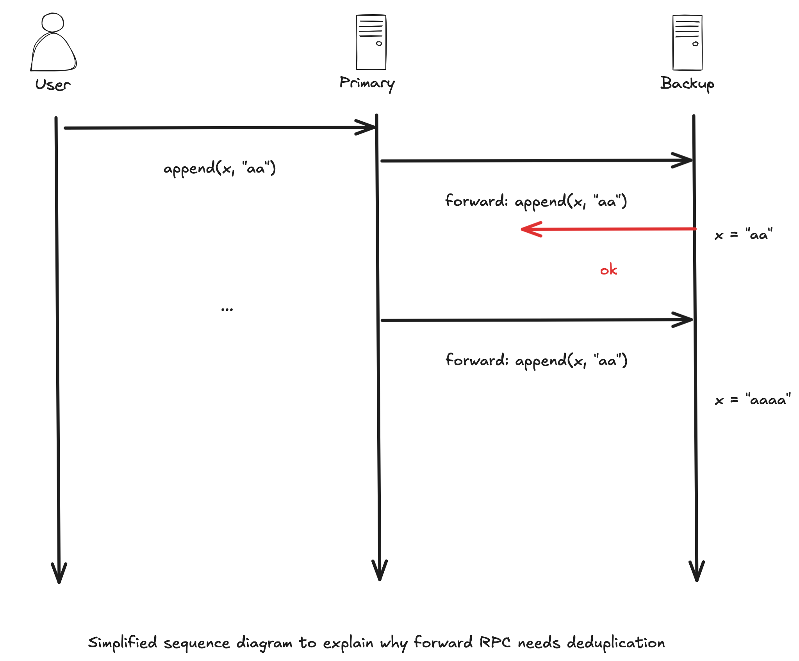
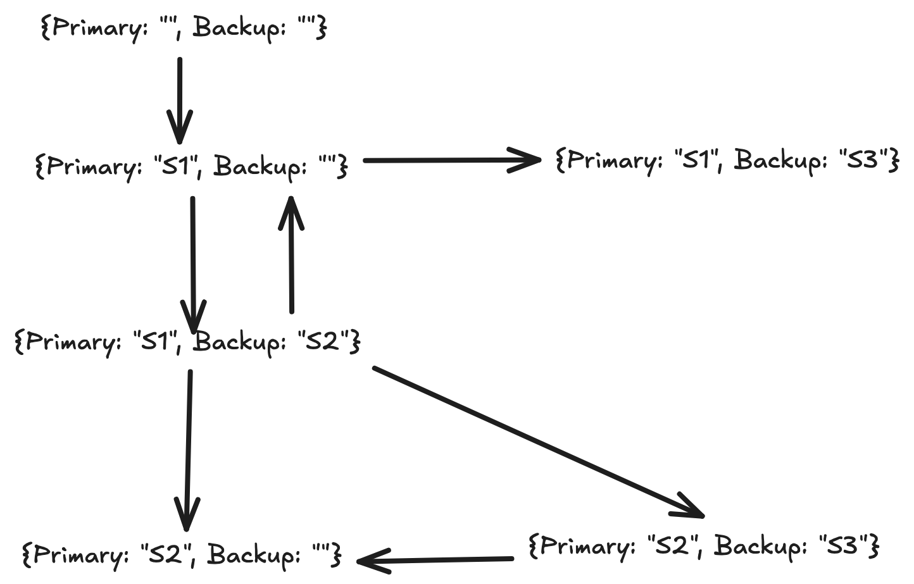

# Primary/Backup Key/Value Service

## Implementation Tips

1. forward client requests(**Get** and PutAppend) from primary to backup
2. the forward RPC (from primary to backup) also needs duplicate detection
3. the forward RPC must wait for the response from the (new) backup

## View Change Example

## Split Brain Prevention

The primary must send Gets as well as Puts to the backup (if there is one), and must wait for the backup to reply before responding to the client. This helps prevent two servers from acting as primary (a "split brain"). An example: S1 is the primary and S2 is the backup. The view service decides (incorrectly) that S1 is dead, and promotes S2 to be primary. If a client thinks S1 is still the primary and sends it an operation, S1 will forward the operation to S2, and S2 will reply with an error indicating that it is no longer the backup (assuming S2 obtained the new view from the viewservice). S1 can then return an error to the client indicating that S1 might no longer be the primary (reasoning that, since S2 rejected the operation, a new view must have been formed); the client can then ask the view service for the correct primary (S2) and send it the operation.

## Fault-tolerance and Performance Limitations 

* The view service is vulnerable to failures, since it's not replicated.
* The primary and backup must process operations one at a time, limiting their performance.
* A recovering server must copy a complete database of key/value pairs from the primary, which will be slow, even if the recovering server has an almost-up-to-date copy of the data already (e.g. only missed a few minutes of updates while its network connection was temporarily broken).
* The servers don't store the key/value database on disk, so they can't survive simultaneous crashes (e.g., a site-wide power failure).
* If a temporary problem prevents primary to backup communication, the system has only two remedies: change the view to eliminate the backup, or keep trying; neither performs well if such problems are frequent.
* If a primary fails before acknowledging the view in which it is primary, the view service cannot make progress---it will spin forever and not perform a view change.

## The K/V Server

* All operations should provide at-most-once semantics.
* A server that isn't the active primary should either not respond to clients, or respond with an error: it should set `GetReply.Err` or `PutReply.Err` to something other than `OK`.

## The Clerk

* Clerk.Get(), Clerk.Put(), and Clerk.Append() should only return when they have completed the operation.

## Related Source code

* The view service source is in [viewservice](viewservice).
* The primary/backup key/value server source is in [pbservice](pbservice).

## Details

http://nil.csail.mit.edu/6.824/2015/labs/lab-2.html

## Test Results

[pb8x480p.mp4.zip](https://github.com/user-attachments/files/24540729/pb8x480p.mp4.zip)

