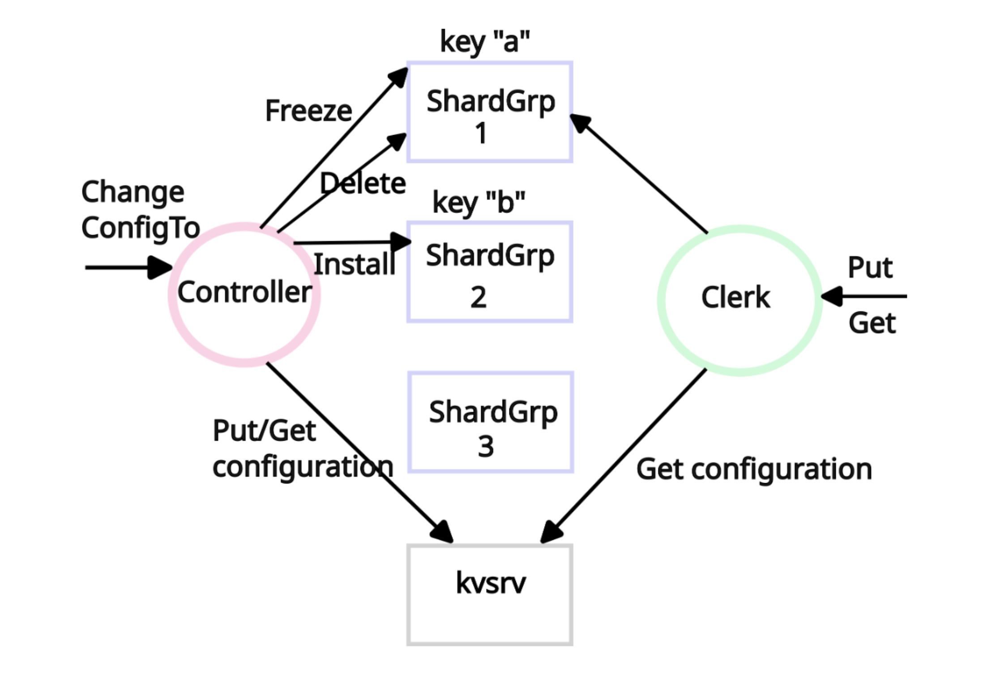

# Sharded Key/Value Service

## High Level Architecture

## Main Challenges

The main challenges in this lab will be ensuring linearizability of Get/Put operations while handling 1) changes in the assignment of shards to shardgrps, and 2) recovering from a controller that fails or is partitioned during ChangeConfigTo.

1. ChangeConfigTo moves shards from one shardgrp to another. A risk is that some clients might use the old shardgrp while other clients use the new shardgrp, which could break linearizability. You will need to ensure that at most one shardgrp is serving requests for each shard at any one time.
1. If ChangeConfigTo fails while reconfiguring, some shards may be inaccessible if they have started but not completed moving from one shardgrp to another. To make forward progress, the tester starts a new controller, and your job is to ensure that the new one completes the reconfiguration that the previous controller started.

## Test Results

Runtime Specifications:

* CPU: 2.3 GHz Quad-Core Intel Core i5
* Memory: 8 GB 2133 MHz LPDDR3
* OS: macOS 15.3.1

https://vimeo.com/1155017742?share=copy&fl=sv&fe=ci
