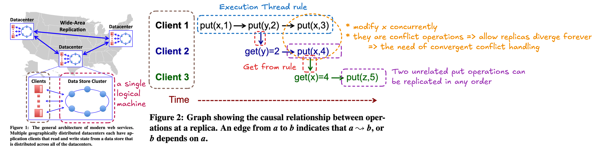
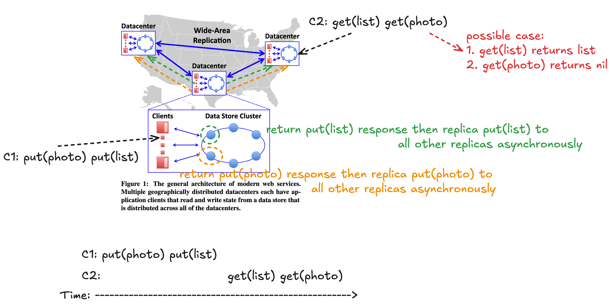
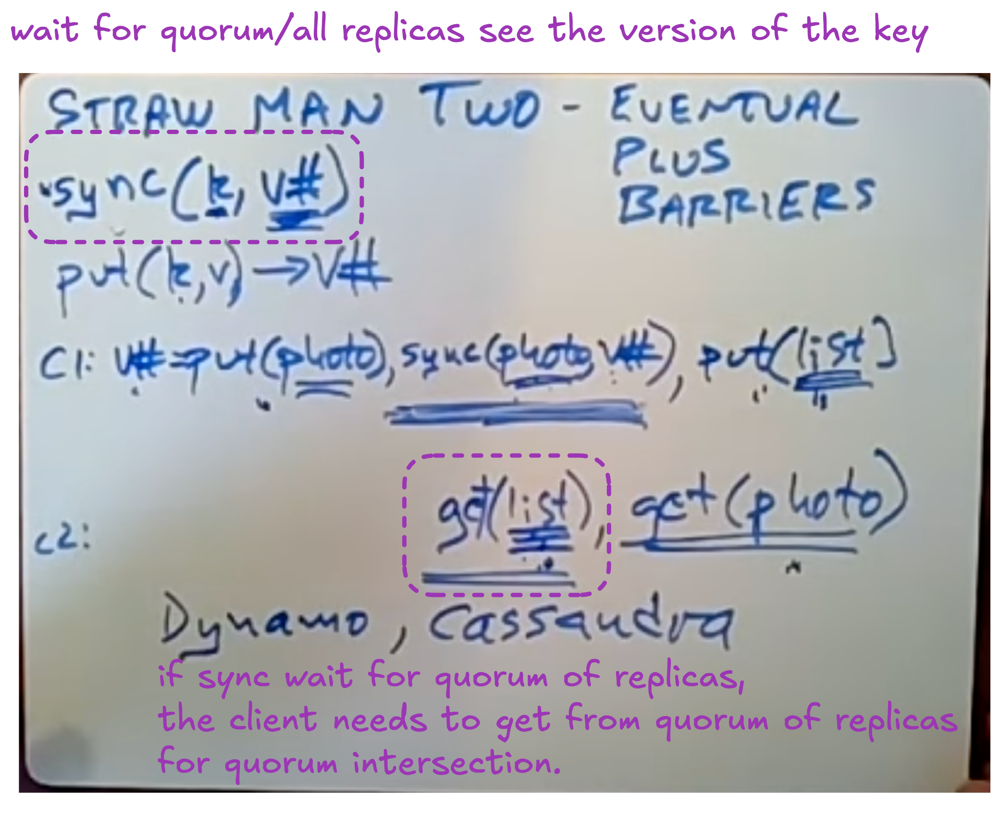
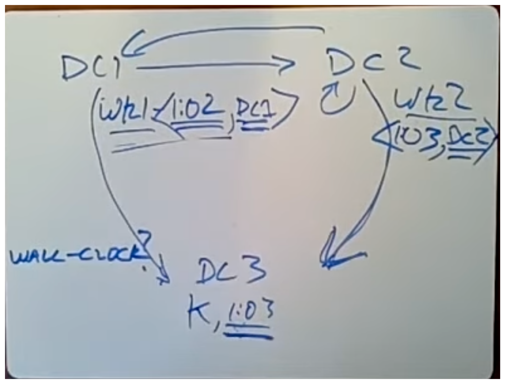

## Novelty

* The first ALPS(Availability, Low Latency, Partition-Tolerance, Scalability) system to achieve non-blocking scalable get transactions that take at most two parallel rounds of intra-datacenter requests.
* Adding N resources to the system increases aggregate throughput and storage capacity by O(N).

## Key Takeaways

## Target Support Applications

It is designed to support complex online applications that are hosted from a small number of large-scale data centers, each of which is composed of frontend servers(clients of COPS) and back-end key-value data stores.

## Weaknesses

COPS-GT:

* less efficient for write-heavy workloads
* less robust to long network partitions and datacenter failures

## Key Properties

* COPS execurtes all put and get operations in the LOCAL datacenter in a LINEARIZABLE fashion
* Causal+ Consisency ensures clients see a causally-correct, conflict-free, and always-progressing data store

---

## Details

### Causal+ Consistency

Three rules define potential causality, denoted =>.

1. Exeuction Thread. If a and b are two operations in a single execution thread, then a => b if a happens before b.
1. Get Form. If a is a *put* operation and b is a *get* operation that **returns the value written by a**, then a => b.
1. Transitivity. If a => b and b => c, then a => c.

Example:

Causal+ Consistency's Two Properties:

* Causal Consistency: values returned from get operations at a replica are consistent with the order defined by => (causality)
    * Two unrelated put operations can be replicated in any order
* Convergent conflict handling: requires that all conflicting puts be handled in the same manner at all replicas, using a handler function *h*
    * Conflict:
        * concurrent put operations to the **same key**
    * This handler function h must be associative and commutative, so that replicas can handle conflicting writes in the order they receive them and that the results of these handlings will converge (e.g., one replica’s h(a, h(b, c)) and another’s h(c, h(b, a)) agree).
    *  COPS uses the **last-writer-wins** rule by default
        * https://en.wikipedia.org/wiki/Thomas_write_rule
        * The last-writer-wins rule is not perfect. 
            * The shopping cart example: C1: put(cart, items), C2: put(cart, items). We want to merge C1 and C2 items instead of picking the last write one.

---

## Questions

Q. What is COPS?

Clusters of Order-Preserving Servers

Q. Causal+ Consistency vs Linearisability

* The operations in the Causal+ Consistency model are not totally ordered but in the Linearisability model are.
* Causal+ Consistency does not guarantee real-time ordering.

Q. Any real applications use causal+ consistency model?

Q. The last sentence in Section 4.3 says a client clears its context after a put, replacing the context with just the put. The text observes "This put depends on all previous key-version pairs and thus is nearer than them." Why does clearing the context and replacing it with just the put make sense? You might think that the client's subsequent puts would need to carry along the dependency information about previous gets. What entity ultimately uses the context information, and why does it not need the information about gets before the last put?

---

## Others

### Strawn man Design 1: Eventual Consistency

Application Example:

First, let Alice try to share a photo with Bob. Alice uploads the photo and then adds the photo to her album. Bob then checks Alice’s album expecting to see her photo.

### Strawn man Design 2: Eventual + Barriers

+: if the get(list) see the photo reference, the get(photo) can see the photo.
-: no local put, needs to wait other replicas

### Problem of using wall clock to determine transaction order

* The wall clock between data center needs toa be synchronized.
* If clock skew, 
   * (1) the transaction order can violate the real-time ordering, 
   * and (2) no new write(s) can be seen in a long period of time if the clock skew is big.
        * e.g. Lets say DC 1 clock is one minute faster than DC 2. If DC 1 has a new Put transaction at 16:13(real-time), then DC 2's Put transactions before 16:14(real-time) can not be seen.

