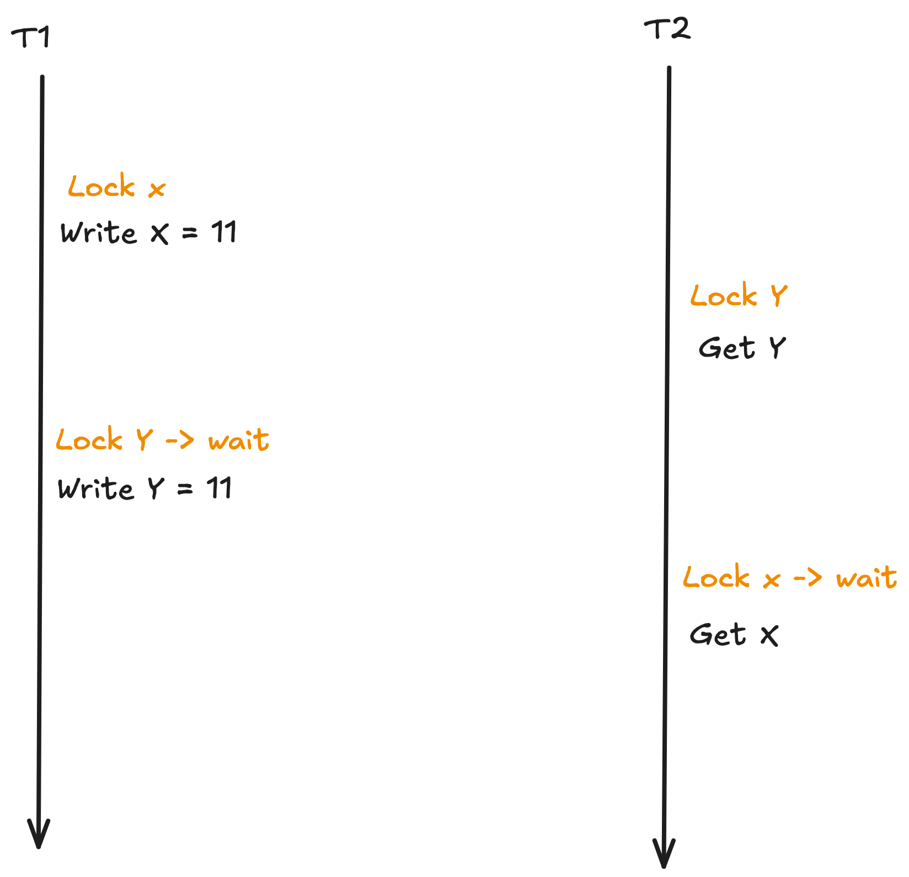

## Key Problem

We want to support cross-machine atomic operations.

For example, we want the transfer 1 dollar amount from x to y. The *x* account balance is stored in kv-store 1 and the *y* account balance is store in kv-store 2.

```
Client                             kv-store 1                            kv-store 2
----------------------------------------------------------------------------------
transdfer(x, y, 1)
|
----------put(x, -1)------------------->
|
--------------------------------------------------put(y, +1)---------------->
|
```

* We want the *transfer(x, y, 1)* with respect to failure: its operations either all success or fail
    * = Atomic in ACID
* We want the *transfer()* with respect to concurrency: from client perspective, the action of transfer operation is completely before-or-after another action of transfer operation or other atomic operation
    * = Isolation in ACID

---

## 9.1.5 Before-or-After Atomicity: Coordinating Concurrent Threads

### Concurrency coordination requirements

* Sequence coordination: Action W must happen before action X
* Before-or-After atomicity: Concurrent actions have the before-or-after property if their **effect** from the point of view of their **invokers** is the same as if the actions occurred either **completely before** or **completely after** onanother.

* Sequence coordination vs Before-or-After atomicity:
    * The before-or-after atomicity property does not necessarily know the **identities** of all the other actions that might touch the shared variable.

## 9.1.6 Correctness and Serialization

Goal: **Application Independence**. We want to be able to make an argument for correctness of the mechanism that provides before-or-after atomicity without getting into the question of whether or not the application using the mechanism is correct. 

Correctness concept: coordniation among concurrent actions can be considered to be correct if **every result** is guaranteed to be one that could have been obtained by some **purely serial application** of those same actions.
    * purely serial application: the application that running with 1 thread

The before-or-after atomicity has the effect of serializing the actions, so it follows that before-or-after atomicity guarantees correctness of coordination.

**External Time Consistency**: if there is any external evidence (such as a printed receipt) that before-or-after action T1 ended before before-or-after action T2 began, the serialization order of T1 and T2 inside the system should be that T1 precedes T2.

**Sequential Consistency**: when the processor concurrently performs multiple instructions from the same instruction stream, the result should be as if the instructions were executed in the original order specified by the programmer.

## 9.5.2 Simple Locking

Simple locking discipline:

1. each transaction must acquire a lock for every shared data object it intends to read or write before doing any actual reading and writing.
1. it may release its locks only **after the transaction installs its last update and commits or completely restores the data and aborts**.

A lock manager can enforce simple locking:

1. supply its intended lock set as an argument of the begin transaction operation
1. interpose itself on all calls to read data and to log changes
1. intercepts the call to commit or abort at which time it auto matically releases all of the locks of the lock set

The setup for showing this simple locking discipline correctly coordinates concurrent transactions:

Imagine that an all-seeing outside observer maintains an ordered list to which it adds each transaction identifier as soon as the transaction reaches its lock point and removes it from the list when it begins to release its locks.


## 9.5.3 Two-Phrase Locking

Two-phrase locking discipline:

1. a transaction to acquire locks **as it proceeds**, and the transaction may read or write a data object as soon as it acquires a lock on that object
1. the transaction may not release any locks until it passes its **lock point**.

Two-phrase:

1. the number of locks acquired by a transaction **monotonically increases** up to the lock point
1. after which it **monotonically decreases**

What is the lock point?

* The transaction has acquired all the locks it will ever need during its entire lifetime.
* From that point onward, the transaction will no longer acquire any new locks.

Two interactions between locks and logs that require some thought:

* individual transactions that abort: **restore its changed data objects** to their original values before releasing any lock for before-or-after atomicity
* log-based recovery: 
    * key question: **whether locks themselves are data objects for which changes should be logged**

## 9.6.3 Multiple-Site Atomicity: Distributed Two-Phase Commit


---

## Questions

Q. In two-phrase locking, why the transaction needs to hold the lock until commiting?

If the transaction releases the lock immediately after the use of a data object, it is possible to have some non-serializable execution. For example,


 
Q. Can two-phrase locking generate deadlock?

Yes, it is possible.



If the transaction system can detect deadlock, the system can abort one of the transaction to unblock other waiting transactions. The client can decide to retry the aborted transaction and hope this transaction can be committed.

Approaches to detect deadlock:

* timeout based: abort one of the transaction if no transaction is making progress after a period of time.
* wait-for graph

Q. 6.033 Book. Read just these parts of Chapter 9: 9.1.5, 9.1.6, 9.5.2, 9.5.3, 9.6.3. The last two sections (on two-phase locking and distributed two-phase commit) are the most important. The Question: describe a situation where Two-Phase Locking yields higher performance than Simple Locking.

* Transaction *Tx1*: perform the conditional read of data object *A* while the condition is rarely to be true.
* So in most cases, the lock of *A* is not acquired.
* Thus, other transactions can acquire the lock of *A* without waiting with transaction *Tx1* or *Tx1* can proceed without waiting other transactions.

Q. In 2PC, is it possible that the worker abort after response "yes" to the PREPARE meessage from coordinator?

No. The worker only response "yes" if the worker 100% can commit the transaction (e.g. no deadlock).

---

## Further Study

* Chapter 9.5.3: the interactions between locks and logs
