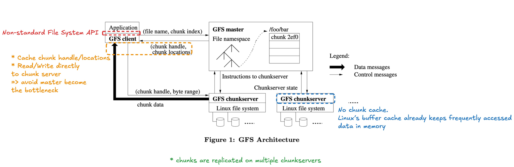
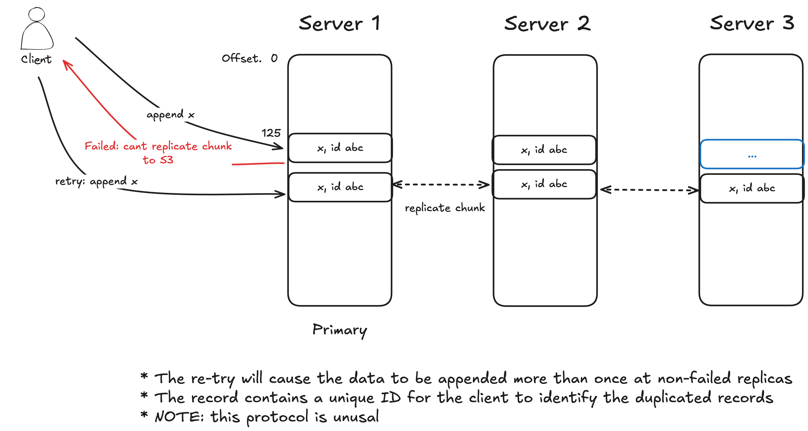
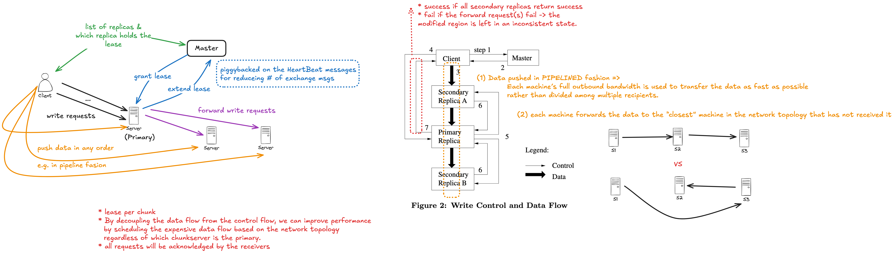
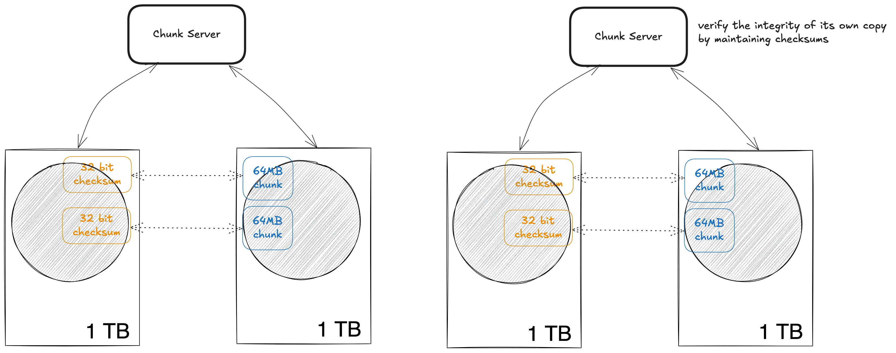
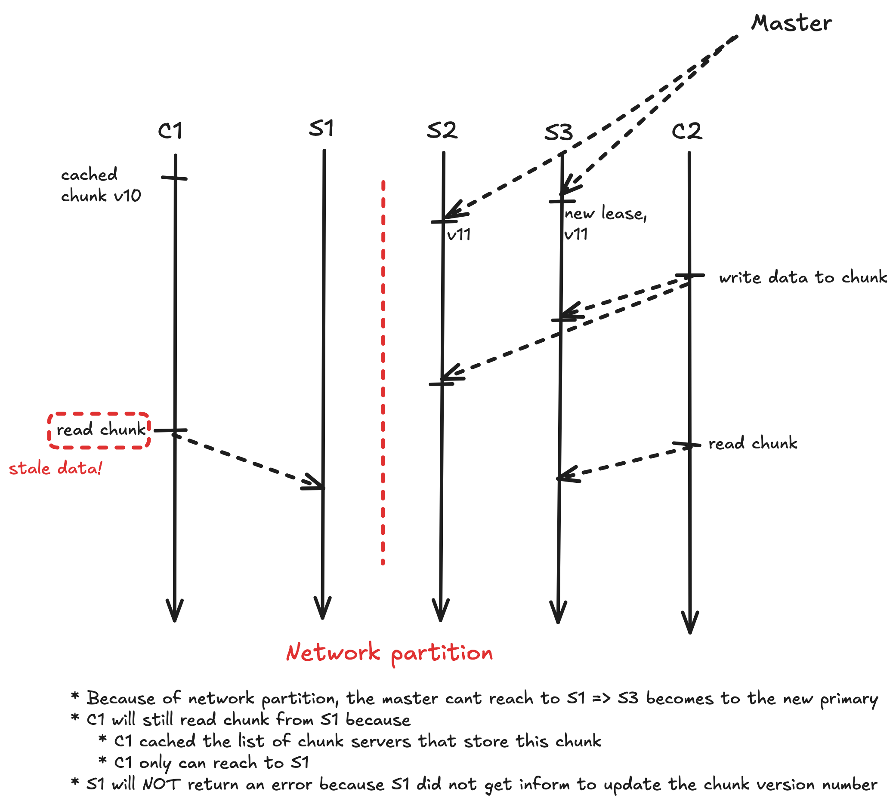

## Novelty

One of the first distributed file systems for data-center applications such as large MapReduce jobs.

## Takeaways

1. Decouple the flow of data from the flow of control to use the network efficiently (See Lease Mechanism and Data flow section for the details)
1. How to detect data corruptions in parallel (See Data Integrity section for the details)

## Strengths and Weaknesses

* Single Master
    * pros: global knowledge about the chunk locations => can make sophisticated chunk placement and replication
    * cons: 
        * single point of failure => fix: primary/backup protocol, check pointing for fast recovery
        * can be performance bottleneck => fix: decouple data flow and control flow, client cache
* The data replication flow can make use of the full bandwidth of each replica
* Trade consistency for performance and simplicity
* The paper contains the details from apps all the way to network successful

---

## Design Assumptions

1. failures are common
1. build reliable system from unreliable components
1. Multi-GB files are the common case and should be managed efficiently
1. Read Workloads: (1) large streaming reads; (2) small random reads
1. Write Workloads: (1) large, sequential writes that append data to files; (2) small writes at arbitrary positions in a file
1. Well-defined semantics for multiple clients that concurrently append to the same file
1. High sustained bandwidth is more important than low latency

## Architecture

## Consistency Model

* namespace locking guarantees atomicity and correctness
* the master’s operation log defines a global total order of these operations

### File Region State After Mutation

* Why concurrent write successes is *consistent but not defined*?
    * See Lease Mechanism

* *Record Append* vs *Write*
    * Record Append: an **atomic** append operation. Client specifies only the data. GFS appends it to the file at lease once atomically.
        * ~ writing to a file with *O_APPEND* in Unix without race conditions when multiple writers do so concurrently.
    * Append: Client sepcifies data and the offset of the file and race conditions can happen.

* After a sequence of successful mutations, the mutated file region is guaranteed to be defined and contain the data written by the last mutation.
    * apply mutations to a chunk in the same order on all its replicas
    * use chunk **version numbers** to detect any replica that has become stale because it has missed mutations while its chunkserver was down
        * stale replicas will never be involved in a mutation or given to clients asking the master for chunk locations.

### Implications for Applications

* Appending over re-writing

## System Interaction

### Lease Mechanism and Data Flow

* If a write by the application is large or straddles a chunk boundary, GFS client code breaks it down into multiple write operations. They all follow the control flow described above but may be **interleaved** with and overwritten by concurrent operations from other clients
* Therefore, the shared file region may end up containing fragments from **different clients**, although the replicas will be **identical** because the individual operations are completed successfully in the same order on all replicas.
* How to find the "closest" server? Use the IP address of the server. The IP address of the server is assigned in a way that match the network topology.

## Master Operation

### Replica Placement

Purposes:

1. maximize data reliability and availability
1. maximize work bandwidth utilization

Solution: spread replicas across machines and racks

### Creation, Re-replication, Rebalancing

Factors of prioritizing the chunk re-replication

* how far it is from its replication level
    * more far -> higher priority
* live files vs recently deleted files
* chunk that is blocking client progress

### Garbage Collection

Advantages of lazy collection:

* Eager deletion may not easy to implement when the component failures are common (e.g. chunk deletion message lost)
* it merges storage reclamation into the regular background activities of the master, such as the regular scans of namespaces and handshakes with chunk servers. The cost is amortized.
* it is done only when the master is relatively free

## Fault Tolerance and Diagnosis

### Data Integrity

* A chunk is broken up into 64 KB blocks. Each has a corresponding 32 bit checksum. Like other metadata, checksums are kept in memory and stored persistently with logging, **separate from user data**.
* Each chunkserver must independently verify the integrity of its own copy by maintaining checksums.
* For reads, the chunkserver verifies the checksum of data blocks that overlap the read range before returning any data to the requester, whether a client or another chunkserver. Therefore chunkservers will not propagate corruptions to other machines. If a block does not match the recorded checksum, the chunkserver returns an error to the requestor and reports the mismatch to the master.

---

## Questions

Q. What are the traditional file system design assumptions that Google have reexamined?

* component *failures* are the norm rather than the exception
* regularly working with fast growing data sets of many *TBs* comprising billions of objects
    * need to revisit I/O operations and block size

Q. What are the advantages and disadvantages of a large chunk size?

Advantages:

* the client can comfortably cache ALL the chunk location information
* client is more likely to perform many operations on a given chunk => reduce network overhead by keeping a persistent TCP connection
* reduces the size of the metadata stored on the master => can keep metadata in memory

Disadvantages:

* internal fragmentation for small file
* the chunkservers storing the chunks of a small file may become HOT SPOTS if many clients are accessing the same file

Q. Why does the master not keep a persistent record of which chunkservers have a replica of a given chunk and request the data from chunkservers at startup, and periodically thereafter?

* This eliminated the problem of keeping the master and chunkservers IN SYNC as chunkservers join and leave the cluster, change names, fail, restart, and
so on.
* A chunkserver has the FINAL WORD over what chunks it does or does not have on its own disks.

Q. Why *Record Append* is restricted to be at most one-fourth of the maximum chunk size can keep worst-case fragmentation at an acceptable level?

* If the last chunk's empty size is 3/4 of the maximum chunk size and the *Record Append*'s data size is 4/5, then we need to **pad 3/4 of the maximum chunk size**.
* If we restrict the *Record Append*'s data size to at most 1/4 , then the padding size will **LESS than 1/4**.

Q. Why does file creation not require a write lock on the parent directory?

TODO

Q. Why we want to limit the number of "recent" creations on each chunk server?

* Because the creation operation reliably predicts imminent heavy WRITE traffic(chunks are created when demanded by writes).
* Thus, limiting the number of "recent" creations on each chunk server is one way to prevent write hot spots.

Q. Why chunk garbage collection in this system is easy?

* The master stores the map of file to list of chunks.
* If the chunk server reports a chunk that is not known to the master, that chunk is "garbage".

Q. Does the master need to store the chunk handle's version number on the stable storage?

* Yes. If the master does not, it cannot tell if the chunk handle is stale.
* Consider the situation that the chunk server 1 that store the latest version of the chunk handle goes down and the chunk server 2 that store the stale chunk handle is up. If the client try to read a file, the master may return chunk server 2 to the client. Then the client will read the stale data.

Q. Why is the client cache(caches the list of chunk handles + chunk servers + chunk version) important?

* There are many clients and only ONE master.
* The client needs to avoid communication with the master to prevent the master becomes the performance bottleneck because the master handles too much clients requests.

Q. Why the chunk server also needs to store the chunk version number?

* When the client want to write a file, the master will select a primary server and 2 secondary servers for storing the chunk.
* The master may selected the chunk servers that are not in-sync (missing some mutation).
* These not in-sync chunk servers can be identified by the chunk version of the chunk servers.
* When a client send the control message (append chunk with version number) to primary server, the primary server will check if the chunk version is aligned.
* The primary server will return error if the chunk versions are mismatched.

Q. If there is a network partition between the master and the primary server, when the master can select a new primary server?

* The master can select a new primary AFTER the lease of the chunk is expired. 
* This is because we want to prevent the system will consist MORE THAN ONE primaries.
    * Why? The client cache can lead to some clients still talk to the old primary.

Q. Describe a sequence of events that would result in a client reading stale data from the Google File System.

Q. How to get stronger consistency?

* update ALL primary and secondaries or NONE

Q. What I find most confusing about the paper?

* Record Append operation and its guarantees
* 4.1 Namespace Management and Locking
