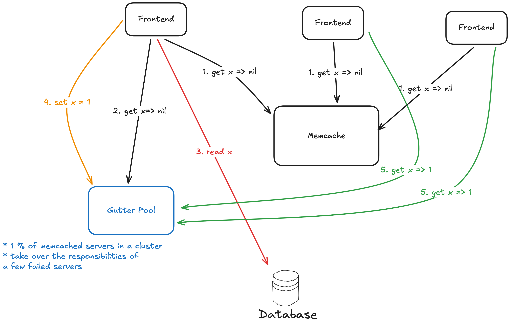
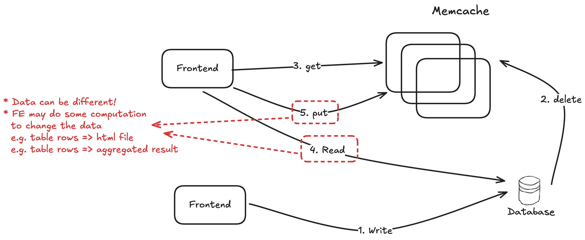
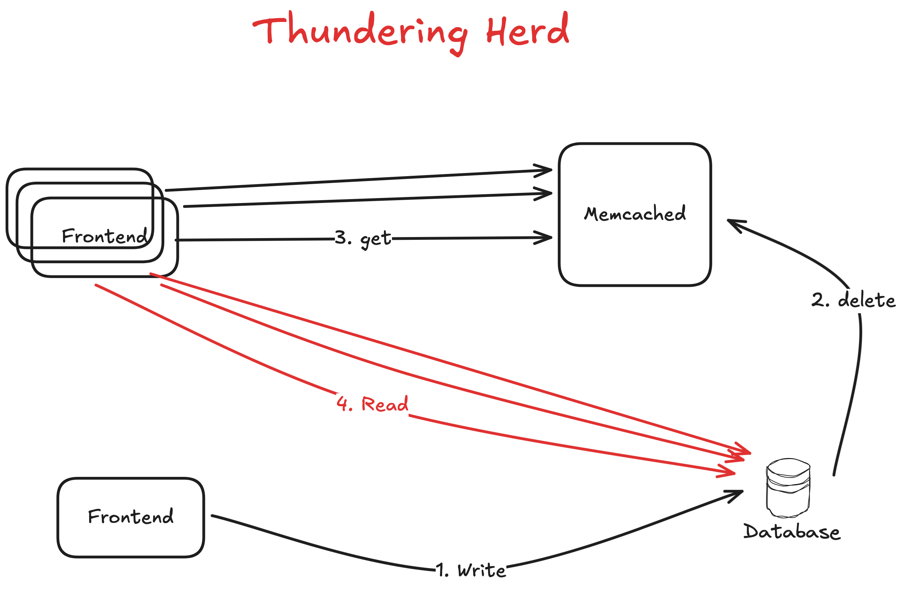

## Design Considerations

* Access Pattern: Read >>>> Write
* Read from multiple data sources: backend servers, MySQL DB, HDFS installations
* Limited engineering resources and time
* Use memache as a general purpose caching layer requires workloads to share infrastructure despite different access patterns, memory footprints, and quality-ofservice requirements
* Use off-the-shelf components

## Key Challenges

* DB + Cache Consistency
    * Eventual Consistency: (1) Write is total ordered. (2) Read cant see latest write is OK. (3) Client reads its own write.
* Avoid DB overload

---

## Details

### In a Cluster: Latency and load

Key focus: 

1. the latency of fetching cached data 
2. the load imposed due to a cache miss

#### Reducing Latency of memcache response


#### Reducing Load

##### Memcache Pools

##### Replication Within Pools

Why favor replication in this instance over further dividing the key space?


#### Handling Failures

Gutter Pool: address the failure of a small number of hosts are inaccessible due to a network or server failure

* When small outage can happen? E.g. Server upgrade, patching
* Entries in Gutter expire quickly to obviate Gutter invalidation
    * => stale data is possible



### In a Region: Replication


---

## Questions

Q. Regarding to query cache, why the web server issues SQL statements to the database and then sends a **delete** request to memcache that invalidates any stale data insteal of "update"?

* Allow the frontend to control what data to put into the cache
    * +: pre-processing before storing into cache
* Optimization: The client deletes the key to allow it read its own write
    * Why? DB's squeal deletes the key asynchronous
    * Why not the client set the latest value of the key in cache after the update of DB?
        * Its harder to implement to deal with concurrent clients
            * See Possible Update Scheme Bad Execution History Example



Possible Update Scheme Bad Execution History Example:

* C1 before C2
* but the cache stores C1's data

```
Time: ---------------------------------------------------------------------->
C1  :   x=1 -> DB                               set(x, 1) -> cache
C2  :              x=2 -> DB  set(x, 2) -> cache                  get(x)=1
```


Q. What is Little Law?


Q. Why a thundering herd happens when a specific key undergoes heavy read and write activity?

Because a SINGLE write triggers MANY frontends read from the database when that key is POPULAR that many frontends need get that key.



Q. How does the lease mechanism solve the thundering herd problem?


Q. How does load-link/store conditional operate? How does the lease mechanism prevent stale sets, similar to how load-link/store conditional operators?


Q. In section 3.2.2, the paper mentioned low-churn and high-churn. What are they? What is the benefit of placing them into different pools?


Q. Section 3.3 implies that a client that writes data does not delete the corresponding key from the Gutter servers, even though the client does try to delete the key from the ordinary Memcached servers (Figure 1). Explain why it would be a bad idea for writing clients to delete keys from Gutter servers.

* Double the delete traffic. Increase the load of Gutter Pool(small set of machine).
* Thundering herd Problem. Increase the load of the DB/backend storage since Gutter Pool return nil instead of stale data.
