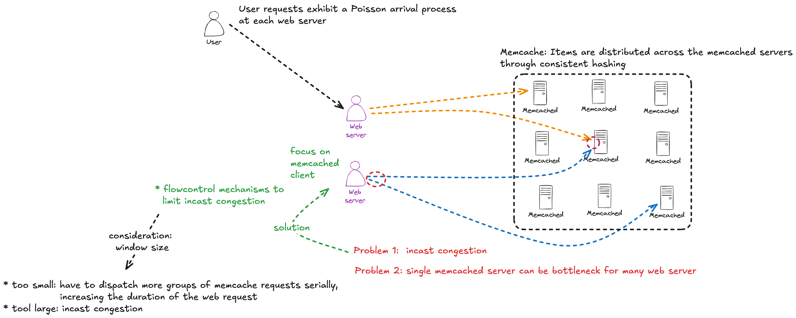
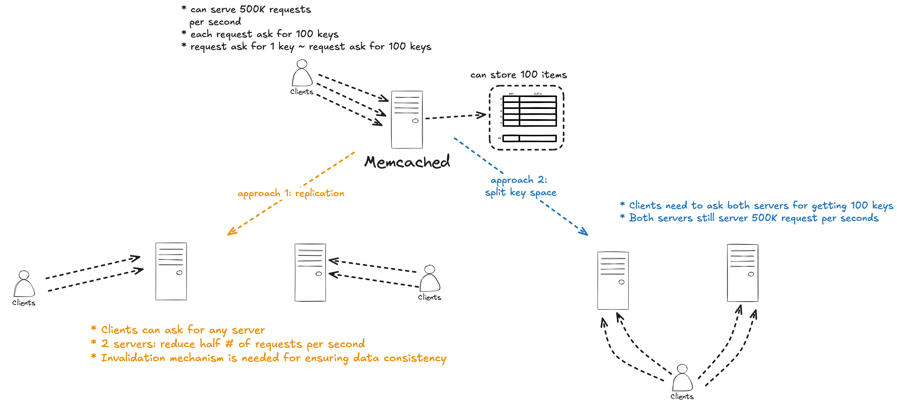

## Design Considerations

* Access Pattern: Read >>>> Write
* Read from multiple data sources: backend servers, MySQL DB, HDFS installations
* Limited engineering resources and time
* Use memache as a general purpose caching layer requires workloads to share infrastructure despite different access patterns, memory footprints, and quality-ofservice requirements

---

## Details

### In a Cluster: Latency and load

Key focus: 

1. the latency of fetching cached data 
2. the load imposed due to a cache miss

#### Reducing Latency of memcache response

#### Reducing Load

##### Memcache Pools

##### Replication Within Pools

Why favor replication in this instance over further dividing the key space?

#### Handling Failures

---

## Questions

Q. Regarding to query cache, why the web server issues SQL statements to the database and then sends a **delete** request to memcache that invalidates any stale data insteal of "update"?

Q. What is Little Law?

Q. Why a thundering herd happens when a specific key undergoes heavy read and write activity?

Q. How does load-link/store conditional operate? How does the lease mechanism prevent stale sets, similar to how load-link/store conditional operators?

Q. In section 3.2.2, the paper mentioned low-churn and high-churn. What are they? What is the benefit of placing them into different pools?

Q. Any deployment assumption about the Gutter pool?

Q. Section 3.3 implies that a client that writes data does not delete the corresponding key from the Gutter servers, even though the client does try to delete the key from the ordinary Memcached servers (Figure 1). Explain why it would be a bad idea for writing clients to delete keys from Gutter servers.

