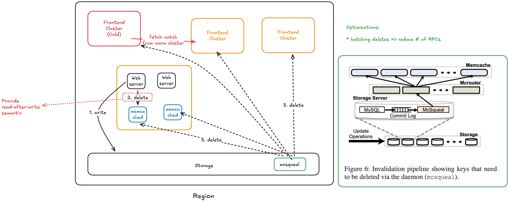
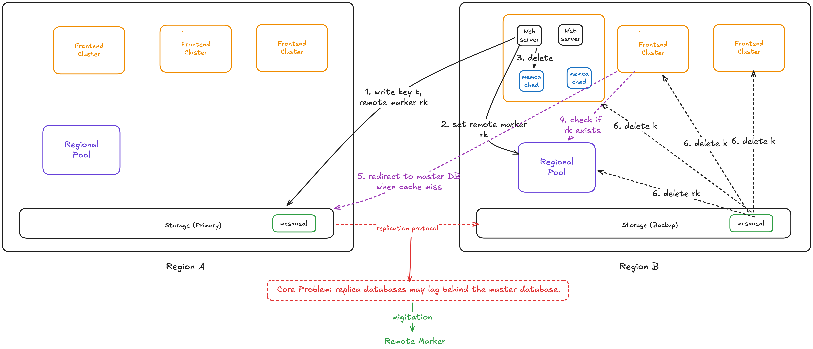

## Key Takeaways

* Cache replication is good for hot keys
* Data inconsistency problems between cache and DB

## Design Considerations

* Access Pattern: Read >>>> Write
* Read from multiple data sources: backend servers, MySQL DB, HDFS installations
* Limited engineering resources and time
* Use memache as a general purpose caching layer requires workloads to share infrastructure despite different access patterns, memory footprints, and quality-ofservice requirements
* Use off-the-shelf components

## Key Challenges

* DB + Cache Consistency
    * Eventual Consistency: (1) Write is total ordered. (2) Read cant see latest write is OK. (3) Client reads its own write.
* Avoid DB overload for performance and prevent cascading failures

---

## Details

### In a Cluster: Latency and load

Key focus: 

1. the latency of fetching cached data 
2. the load imposed due to a cache miss

#### Reducing Latency of memcache response


##### Replication Within Pools

Why favor replication in this instance over further dividing the key space?


#### Handling Failures

Gutter Pool: address the failure of a small number of hosts are inaccessible due to a network or server failure

* When small outage can happen? E.g. Server upgrade, patching
* Entries in Gutter expire quickly to obviate Gutter invalidation
    * => stale data is possible


### In a Region: Replication



Cold cluster warmup inconsistency:

1. key k starts out with value v1.
2. client C1 updates k to v2 in the DB
3. C1 and the DB send delete(k) to the memcache cold cluster
    but the DB is slow at sending delete(k) to the warm cluster
4. client C2 sends get(k) to the cold cluster, which sends back a "miss"
5. C2 sends get(k) to the warm cluster, receives v1
6. C2 set(k, v1) into cold cluster
7. the DB's delete(k) finally reaches the warm cluster

Now the cold memcache cluster holds the stale v1 value, but the delete() has already happened. So the value will stay stale indefinitely, until the key is next written.

The two-second hold-off scheme solves this. After C1 calls delete(k), the cold cluster memcached ignores any set(k) for two seconds. By then, the DB's delete(k) should have reached the warm cluster.

### Across Regions: Consistency

Remote Marker: the presence of a remote marker helps distinguish whether a non-master database holds stale data or not.



---

## Questions

Q. Regarding to query cache, why the web server issues SQL statements to the database and then sends a **delete** request to memcache that invalidates any stale data insteal of "update"?

* Allow the frontend to control what data to put into the cache
    * +: pre-processing before storing into cache
* Optimization: The client deletes the key to allow it read its own write
    * Why? DB's squeal deletes the key asynchronous
    * Why not the client set the latest value of the key in cache after the update of DB?
        * Its harder to implement to deal with concurrent clients
            * See Possible Update Scheme Bad Execution History Example


Possible Update Scheme Bad Execution History Example:

* C1 before C2
* but the cache stores C1's data

```
Time: ---------------------------------------------------------------------->
C1  :   x=1 -> DB                               set(x, 1) -> cache
C2  :              x=2 -> DB  set(x, 2) -> cache                  get(x)=1
```


Q. Why a thundering herd happens when a specific key undergoes heavy read and write activity?

Because a SINGLE write triggers MANY frontends read from the database when that key is POPULAR that many frontends need get that key.


Q. How does the lease mechanism solve the thundering herd problem?

**Rate-Limiting of new lease issuance**. Here's the flow on a cache miss:

1. A client requests a key → cache miss.
1. The Memcache server issues a lease to only one client every ~10 seconds per key.
1. The client with the lease:
    1. Fetches fresh data from the database.
    1. Attempts to set it in cache with the lease token (server validates it).
1. Other concurrent clients (within the 10-second window):
    1. Do not get a lease.
    1. Instead, they receive a special response indicating temporary unavailability.
1. They **briefly retry/wait** until the lease holder populates the cache.

Note: Lease validity = until invalidated by delete.


Once the lease holder sets the fresh value, subsequent gets hit the cache normally.

Q. How does the lease mechanism prevent stale sets?

* The delete call implies there is a newer version of the data in DB.
* The cache invalidates the lease once the key is deleted.

```
Timeline: ----------------------------------------------------------------------------------------------------------------->
C1      :   1.get(x) -> nil, lease 2.read x from DB -> v1                                  5. set(x, v1), lease -> Invalid lease
C2      :                                                  3.write x=v2 to DB  4.delete(x)
```

or

```
Timeline: ----------------------------------------------------------------------------------------------------------------->
C1      :   1.get(x) -> nil, lease 2.read x from DB -> v1           4. set(x, v1), lease -> OK
C2      :                                                  3.write x=v2 to DB                   5.delete(x)
```

Q. In section 3.2.2, the paper mentioned low-churn and high-churn. What are they? What is the benefit of placing them into different pools?


Q. Section 3.3 implies that a client that writes data does not delete the corresponding key from the Gutter servers, even though the client does try to delete the key from the ordinary Memcached servers (Figure 1). Explain why it would be a bad idea for writing clients to delete keys from Gutter servers.

* Double the delete traffic. Increase the load of Gutter Pool(small set of machine).
* Thundering herd Problem. Increase the load of the DB/backend storage since Gutter Pool return nil instead of stale data.

---

## TODO

* Read Section 6 to the end
