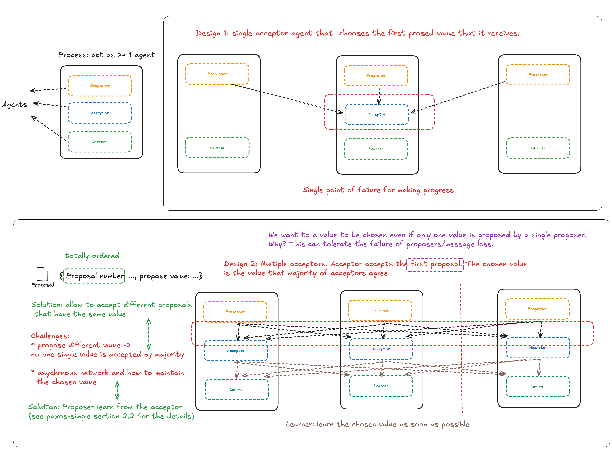

## Key Takeaways

---

## Algorithm Assumptions

* Asynchronous network
* Fail-recover failure mode

## Guarantee

* Safety
* Eventual Liveness

## Details

### Choosing a Value and Learning a Chosen Value

---

## Questions

Q. Suppose that the acceptors are A, B, and C. A and B are also proposers. How does Paxos ensure that the following sequence of events can't happen? What actually happens, and which value is ultimately chosen?

1. A sends prepare requests with proposal number 1, and gets responses from A, B, and C.
2. A sends accept(1, "foo") to A and C and gets responses from both. Because a majority accepted, A thinks that "foo" has been chosen. However, A crashes before sending an accept to B.
3. B sends prepare messages with proposal number 2, and gets responses from B and C.
4. B sends accept(2, "bar") messages to B and C and gets responses from both, so B thinks that "bar" has been chosen.

Q. Paxos vs Raft

| Difference | Paxos | Raft |
| - | - | - |
| Proposing Value | Leaderless: Any process can propose a value | Only leader can propose a value |
| Consensus | Single-shot consensus | Multi-shot consensus |

Q. In section 2.2, the author said P1 and the requirement that a value is chosen only when it is accepted by a majority of acceptors imply that an acceptor must be allowed to accept more than one proposal. Why?

---

## Possible Further Study

* Multi Paxos
