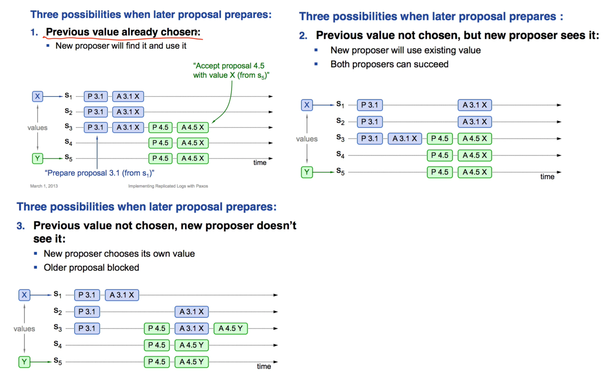
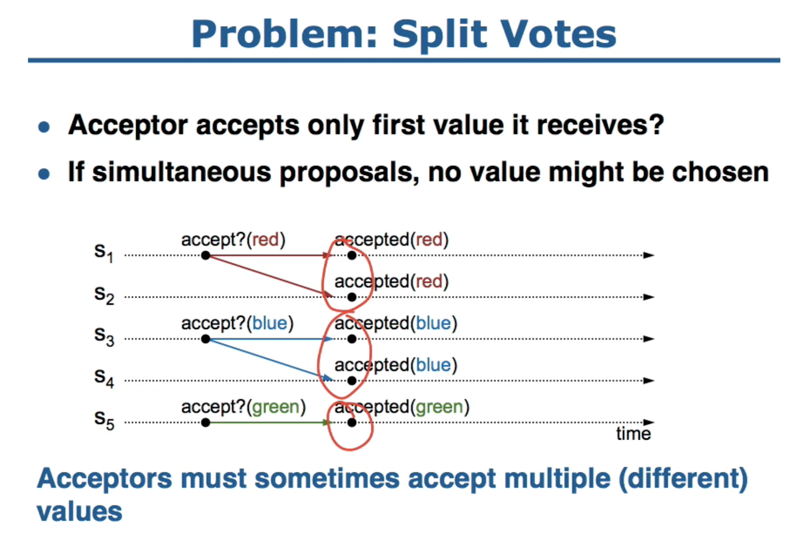
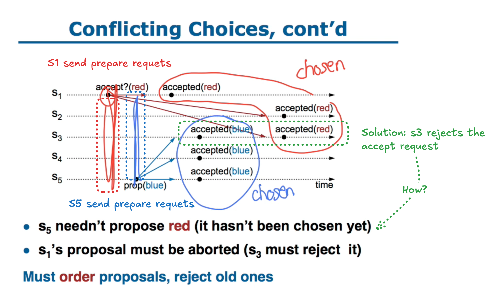

## Key Takeaways

* To maintain the chosen value/the set S(see P2C invariant), (1) the proposers learn from the majority of acceptors before creating and sending the proposal and (2) the acceptor only accept a higher numbered proposal that it accepted
    * any later majority will share at least one server w/ any earlier majority =>
    * any later majority can find out what earlier majority decided
* The majority of acceptors have the same value "X" !=  "X" is the chosen value

---

## Algorithm Assumptions

* Asynchronous network
* Fail-stop failure mode
* Each process has a stable storage 
    * it is used to maintain the information that the acceptor must remember
    * proposer remembers the highest-numbered proposal it has tried to issue

## Guarantee

* Safety
* Eventual Liveness

## Weaknesses

* Only one proposer knows which value has been chosen. If other servers want to know, they must execute Paxos with their own proposal.
* Livelock is possible even in synchronous network

## Details

### Choosing a Value and Learning a Chosen Value


The "chosen" is system-wide property: no server can tell locally that agreement was reached.

If the proposer receives a response to its prepare requests (numbered n) from a majority of acceptors**(make sure the proposer hears of any previously chosen value)**, then it sends an acceptrequest to each of those acceptors for a proposal numbered n with a value v , where v is **the value of the highest-numbered proposal among the responses**(avoid changing the existing choice), or is any value if the responses reported no proposals.

Proposal number: round number || server id

* max round number: round number is the largest round number the server has seen so far
* to generate a unique proposal number
    * increase max round number
    * concatenate with server id

### Three Possibilities when later proposal prepares

1. Previous value is chosen
2. Previous value not chosen, new proposer see it
3. Previous value not chosen, new proposer doesn't see it
    * new proposer doesn't see it => acceptors that accept the previous value is not a majority



Livelock is possible.

### Progress

Progress means a value can be chosen.

The algorithm chooses a leader, which plays the roles of the distinguished proposer.

---

## Questions

Q. Suppose that the acceptors are A, B, and C. A and B are also proposers. How does Paxos ensure that the following sequence of events can't happen? What actually happens, and which value is ultimately chosen?

1. A sends prepare requests with proposal number 1, and gets responses from A, B, and C.
2. A sends accept(1, "foo") to A and C and gets responses from both. Because a majority accepted, A thinks that "foo" has been chosen. However, A crashes before sending an accept to B.
3. B sends prepare messages with proposal number 2, and gets responses from B and C.
4. B sends accept(2, "bar") messages to B and C and gets responses from both, so B thinks that "bar" has been chosen.

B will NOT send accept(2, "bar").
B will send accept(2, "foo") instead.
Because B learns C accepted "foo".

Q. Paxos vs Raft

| Difference | Paxos | Raft |
| - | - | - |
| Proposing Value | Leaderless: Any process can propose a value | Only leader can propose a value |
| Consensus | Single-shot consensus | Multi-shot consensus |

Q. In section 2.2, the author said P1 and the requirement that a value is chosen only when it is accepted by a majority of acceptors imply that an acceptor must be allowed to accept more than one proposal. Why?

* P1: An acceptor must accept the first proposal that it receives.
* Multiple Proposers => Sx may initially hear of one, Sy may hear of another.
* Sx or Sy must change its mind by accepting non-first proposal(s) such that a value can be accepted by a majority of acceptors.



Q. Why an acceptor can accept a proposal numbered n iff it has not responded to a prepare request having a number greater than n?

The chosen value can be changed.



Another bad example if the accept handler does not check n >= n_p:

```
S1: p1 p2 a1A
S2: p1 p2 a1A a2B
S3: p1 p2     a2B
```

Q. example 2 (concurrent proposers):

```
S1 starts proposing n=10
S1 sends out just one accept v=X
S3 starts proposing n=11
  but S1 does not receive its proposal
  S3 only has to wait for a majority of proposal responses
S1: p10 a10X
S2: p10        p11
S3: p10        p11  a11Y
S1 is still sending out accept messages...
```

* Has a value been chosen? 
    * The value is not been chosen because no majority of acceptors has the same value.
* Could it go either way (X or Y) at this point?
    * It could go Y at this point, the a10X messages will be rejected by S2 and S3 but they can accept a11Y.
* What will happen?
    * what will S2 do if it gets a10X accept msg from S1?
        * reject because the proposal number 10 is < its highest-numbered proposal 11
    * what will S1 do if it gets a11Y accept msg from S3?
        * accept and update its proposal number to 11
* What if S3 were to crash at this point (and not restart)?
    * S1 or S2 can create a new proposal and pick X as value
    * S2 will learn X from S1

Q. how about this:

```
S1: p10  a10X               p12
S2: p10          p11  a11Y  
S3: p10          p11        p12   a12X
```

Has the system agreed to a value at this point?
  after all, a majority have accepted value "X"

No, if S3 is down and S1 create a new proposal p13, S1 must need to get prepare response from S2.
Since, S1's value "X" is from proposal 10 ( < a11Y ), S1 will send a13Y instead of a13X.
Now, the majority of acceptors (S1 and S2) change to hold "Y".
Thus, the value "X" is not the chosen value.

Q. What is the commit point? After a majority has the same v_a/n_a?

Yes.

Suppose majority has same v_a/n_a.
Acceptors will reject accept() with lower n.
For any higher n: prepare's must have seen our majority v_a/n_a (overlap).

Q. Why does the proposer need to pick v_a with highest n_a?

```
S1: p10  a10A               p12
S2: p10          p11  a11B  
S3: p10          p11  a11B  p12   a12?
n=11 already agreed on vB
n=12 sees both vA and vB, but must choose vB
```

why: two cases:

1. there was a majority before n=11

```
S1: p10  a10A               p12
S2: p10  a10A    p11  a11A  
S3: p10                     p12   a12?
```

n=11's prepares would have seen value and re-used it
so it's safe for n=12 to re-use n=11's value

2. there was not a majority before n=11

```
S1: p10  a10A               p12
S2: p10          p11  a11B  
S3: p10                     p12   a12?
```

n=11 might have obtained a majority
so it's required for n=12 to re-use n=11's value

Q. Why does accept handler update n_p = n?

* the accept messages quorum and the prepare messages quorum can be different =>
* server can get accept(n,v) even though it never saw prepare(n)

Example:

```
S1: p10   a10X
S2: p10
S3:       a10X 
```

The accept handler updates n_p = n to prevent the earlier's n being accepted. Acceptor code:

```
9	acceptor state on each node (persistent):
10	 np     --- highest prepare seen
11	 na, va --- highest accept seen

12	acceptor's prepare(n) handler:
13	 if n > np
14	   np = n
15	   reply prepare_ok(n, na, va)
16   else
17     reply prepare_reject


18	acceptor's accept(n, v) handler:
19	 if n >= np
20	   np = n
21	   na = n
22	   va = v
23	   reply accept_ok(n)
24   else
25     reply accept_reject
```

without n_p = n, can get this bad scenario:

```
S1: p1     a2y  a1x p3 a3x
S2: p1 p2  a2y      
S3:    p2           p3 a3x
            ^           ^
            |           |
        y is chosen => b is chosen
```

---

## Lecture

https://www.youtube.com/watch?v=JEpsBg0AO6o
