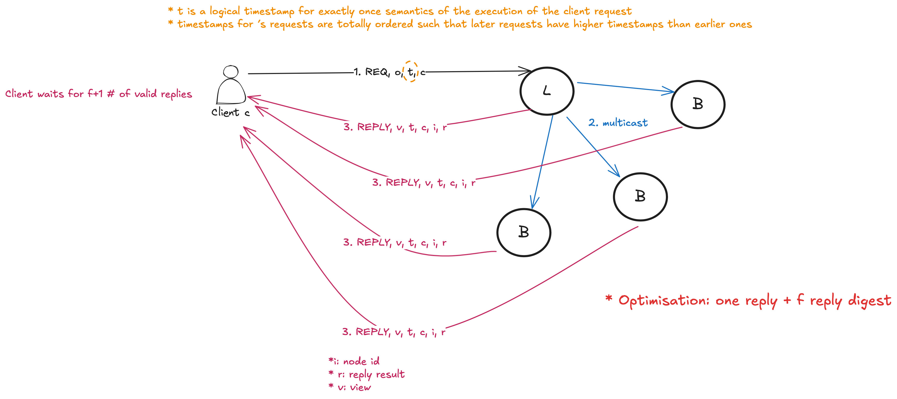
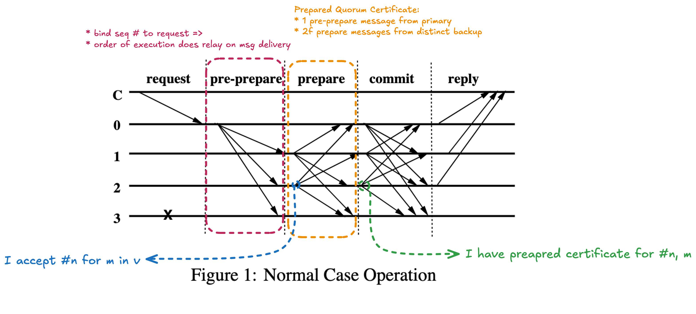
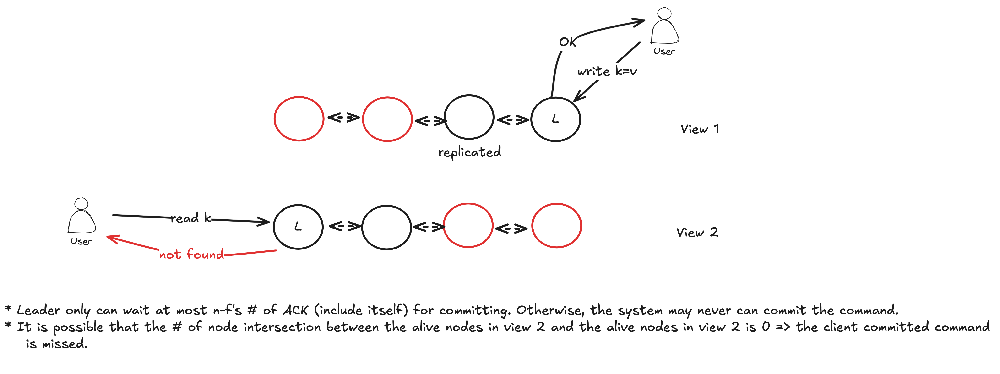

## Novelty

First BFT protocol that provide safety without sychrony assumption and it is practical for real system (a PBFT-replicated NFS file server had only ≈3% overhead compared to an unreplicated one).

## Assumptions

* Honest client
    * the client waits for one request to complete before sending the next one.
    * but we can allow a client to make asynchronous requests, yet preserve ordering constraints on them.
* At most *f* # of nodes can be byzantine where total # of nodes is *3f + 1*
* Permissioned setting: known and fixed set of nodes
* PKI: all replicas know the others' public keys
* Network: the messages can be delayed(finite unknown time), out-of-order, duplicated, or missed

## Strengths & Weaknesses

+: Safety in asynchronous network
+: Optimal byzantine fault tolerance: *3f+1* nodes can tolerant *f* node failures

-: *O(n^2)* message complexity in prepare phrase and commit phrase
-: Does not prevent sybil attack

## Guarantees

Consensus:

* Safety in asynchronous network
* Liveness in sychronous network

Client:

* client's replies are correct according to linearizability

---

## Details

### View

* View: describe a group of replicas where 1 replica is primary and the remaining replicas are backups
* Goal of view change: to survive failure of primary

### Client

* Why is the view number included in the client reply? What is the problem of the replies are coming from different view?
    * I think the main problem is different views -> different leaders.

### Normal-Case Operation

Three phase algorithm:

1. pre-prepare picks ordre of requests
2. prepare ensures order within view
    * order: if one non faulty replica commit message m, no non-faulty replica commit m'
    * by *2f + 1* # of P-certificate
3. commit ensures order across views
    * ensure at least *f+1* non-fault replica prepared
        * byzantine replica only send P-certificate to some non-fault replicas to trick only some non-faulty replicas to commit
    * collecting by *2f + 1* # of C-certificate
        * any quorum for C-certificate has at least one honest replica that has P-certificate
        * => View Change Safety
        * The usage of this intersected P-certificate:

Replica only execute a request if it has a quorum for C-certificate.

### View Change Protocol

TODO

---

## Questions

Q. Viewstamped Replication vs PBFT

The PBFT protocol is an extension of the VR protocol that can tolerate byzantine failures.

Q. Why survive *f* number of failstop failures need *2f + 1* number of replicas?

Q. Does the byzantine primary can order the client messages however it want?

* Yes, the byzantine primary can re-order the client messages because sequence number is assigned by the primary.
* But the backups may have some ways to judge the mapping of seq # to client request. If they think this mapping is not correct, they will NOT send prepare message.

Q. Suppose that we eliminated the pre-prepare phase from the Practical BFT protocol. Instead, the primary multicasts a PREPARE,v,n,m message to the replicas, and the replicas multicast COMMIT messages and reply to the client as before. What could go wrong with this protocol? Give a short example, e.g., ``The primary sends foo, replicas 1 and 2 reply with bar...''

Short concrete attack scenario (with 3f+1 = 4 replicas, f = 1):

* Replicas are 0, 1, 2, 3
* Replica 0 is the malicious primary
* Replicas 1 and 2 are honest, replica 3 is also malicious (or simply silent)

The malicious primary does the following:

* Primary (0) multicasts ⟨PREPARE, v, n, request=A⟩ only to replica 1
* Primary (0) multicasts ⟨PREPARE, v, n, request=B⟩ only to replica 2

Honest replica 1:

* receives ⟨PREPARE, v, n, A⟩ from primary → multicasts ⟨COMMIT, v, n, digest(A)⟩
* collects 2f+1 = 3 matching COMMITs (itself, primary 0, malicious 3 can echo A) → commits request A for n and replies to client with result of A

Honest replica 2:

* receives ⟨PREPARE, v, n, B⟩ from primary → multicasts ⟨COMMIT, v, n, digest(B)⟩
* collects 3 matching COMMITs (itself, primary 0, malicious 3 echoes B) → commits request B for n and replies to client with result of B

Result:

* Two honest replicas (1 and 2) have committed different requests (A vs B) for the same sequence number n in the same view v.

Q. Leader election: PBFT vs Raft

PBFT selects leader in deterministically but Raft doesn't

Q. Can some lag-behind replicas "catch-up"?

Q. What will happen if the new selected primary is byzantine and it does not send *NEW-VIEW* message?

---

## Talks or Lectures

1. https://www.youtube.com/watch?v=Uj638eFIWg8
1. https://www.youtube.com/watch?v=S2Hqd7v6Xn4
1. https://www.youtube.com/watch?v=Q0xYCN-rvUs
1. https://www.youtube.com/watch?v=JEKyVMUjFPw

---

## Futher Study

* Tendermint
* HotStuff

---

## TODO

* View Change Protocol
* read section 5 to the end
