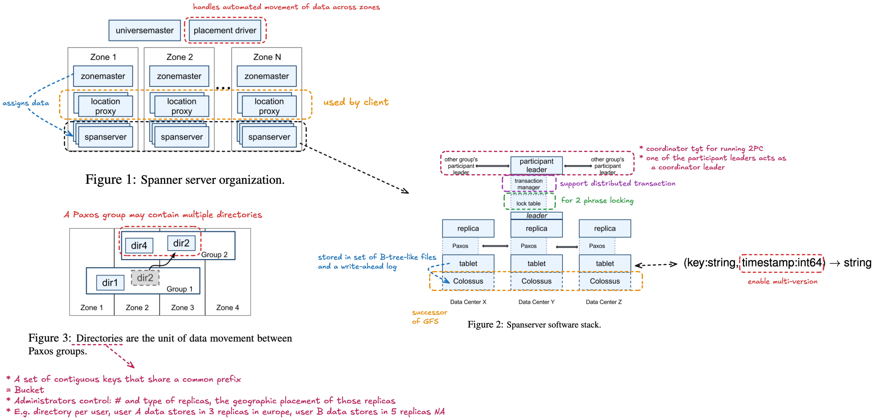
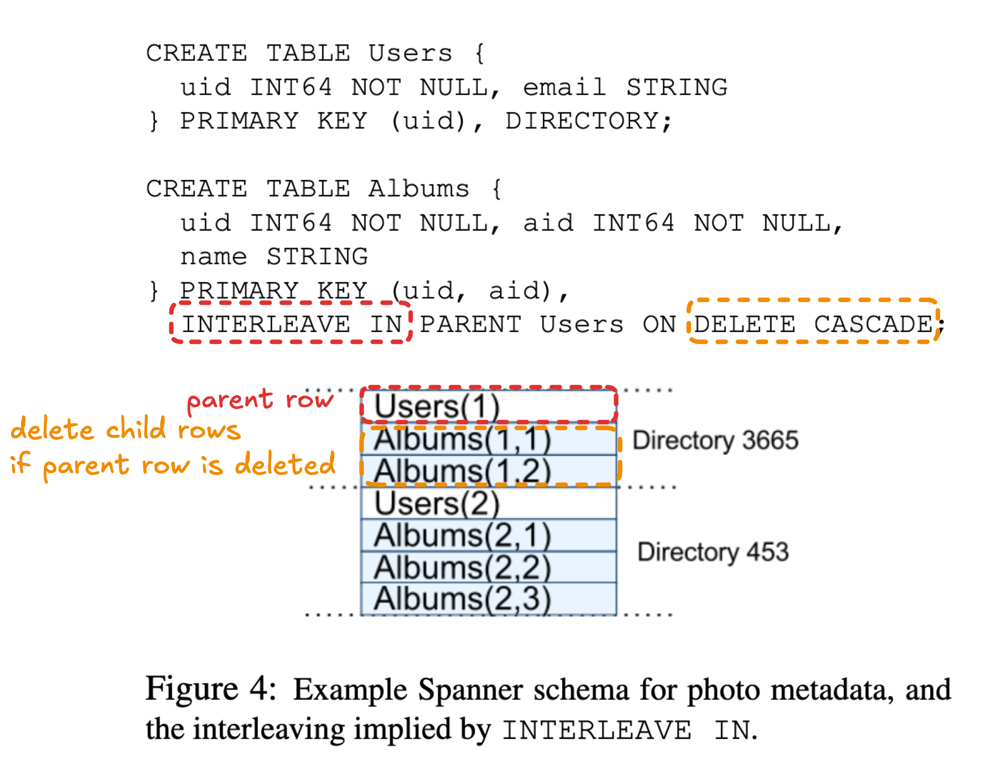
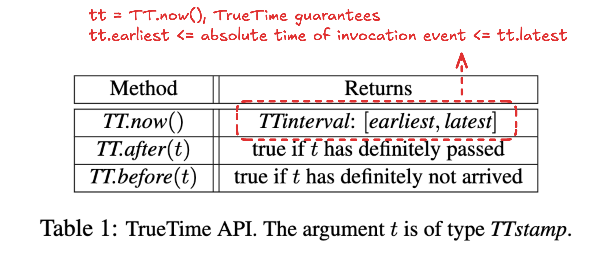
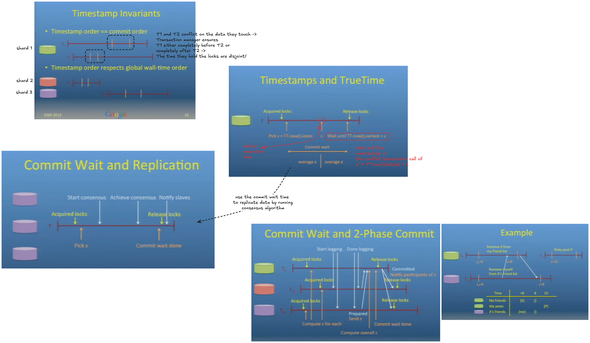
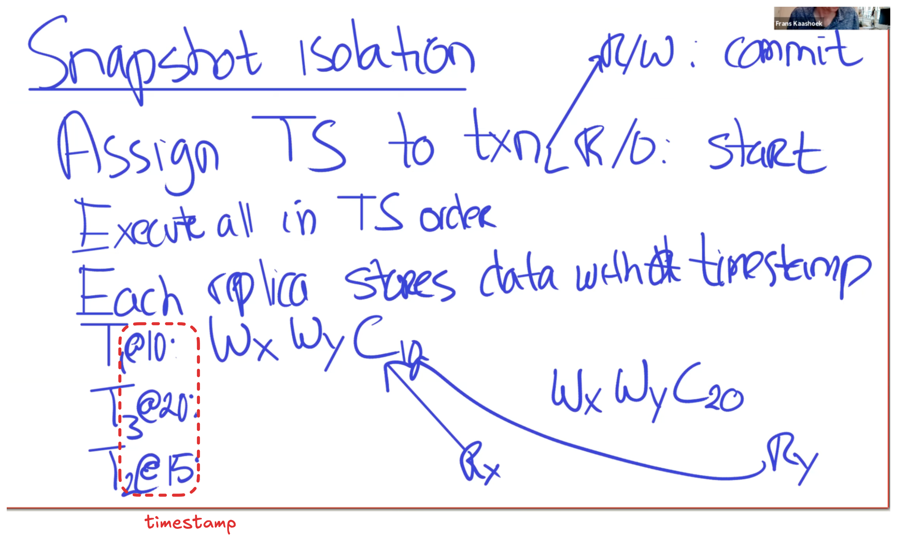
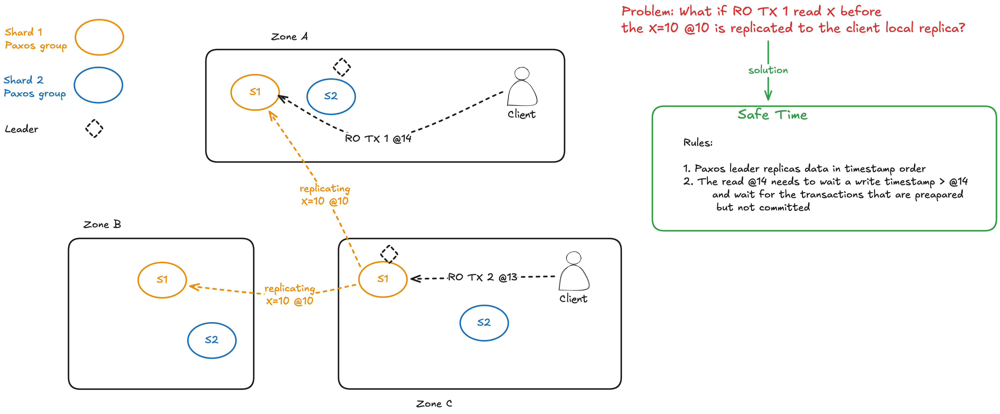

## Novelty

* The first system to distribute data at global scale and support externally-consistent distributed transactions.
* Read-only transaction is 10x faster than read-write transaction.

## Motivations of building spanner

* Bigtable can be difficult to use for some kinds of applications: those that have **complex, evolving schemas**, or those that want **strong consistency in the presence of wide-area replication**.
* Megastore is semirelational data model and it supports for synchronous replication, but its relatively **poor write throughput**.

## Design Challenges

* Read from the local replica yield latest write
* Support transaction across shards
* Transaction msut be linearizable

---

## Details

### Spanserver Software Stack and Placement

### Data Model

* ~ SQL database
    * row-based
    * key-value mapping = primary-key columns -> non-primary-key columns

Schema Example:

### TrueTime API

### Concurrency Control

Wilson Hsieh Presentation:

---

## Questions

Q. What is external consistency?

It means linearizability(with respect the real time ordering) according to the paper's introduction section. If a transaction T1 commits before another transaction T2 starts, then T1’s commit timestamp is smaller than T2’s.

Q. One spanserver == One replica in paxos group?

Yes.

Q. The benefit of shards

If the transactions are disjoint in term of shards, the transactions can run in parallel.

Q. The benefit of Paxos per shard

To commit a transaction, we only need the majority agreement. =>

* improve performance by toleranting some SLOW machine.
* data center fault tolerance

Q. read-write transaction vs read-only transaction vs snapshot read

Timestamp:

* system-provided: read-write transaction, read-only transaction
* client-provided: snapshot read

Operation:

* involve write: read-write transaction
* read-only: snapshot read, read-only transaction

Q. What is snapshot isolation?

Both `read x` and `read y` read the most recent version of `x` and `y` that less than the snapshot transaction timestamp

Problem: What if RO TX 1 read X before the X=10 @10 is replicated to the client local replica?

Q. Why one of the participant leaders act as a coordinator leader to run 2PC?

* In 2PC, the coordinator is the single point of failure. If it fails, the protocol will be blocked. The replicas need to hold the locks until the coordinator come back.
* The participant leader is one of the replica in the Paxos group. If it fails, the Paxos will elect another non-faulty replica as participant leader. Thus, the coordinator leader becomes HA.

Q. In distributed read-write transaction, what are the locks will be replicated in a Paxos group? And why replicate?

* The locks(their statues) that involve in the 2PC will be replicated when the leader **prepares** the 2PC transaction. The locks for other non-2PC transactions will NOT be replicated.
* These locks are replicated because that they cannot be lost if the leader fails. The new leader needs know the 2PC transaction state(PREPARED) and the locks to (1) BLOCK the transactions that conflict with this prepared 2PC transaction for guarantee linearizability and (2) partial commit problem.
* Note: Only the Paxos group leader will handle the transaction => No situation that replica 1 processes transaction 1 and replica 2 processes transaction 2

Q. Why commit is inevitable once a timestamp has been chosen for both read-only transactions and snapshot reads?

Q. Why MVCC(Multi-Version Concurrency Control) can help read-only transaction observes consistent snapshot(snapshot that is consistent with causality)?

* The system ensures if the transaction *t1* -> *t2*, then the timestamp of *t1* < the timestamp of *t2*.
    * commit order respects global wall-time order 
    * timestamp order repsects == global wall-time order
    * timestamp order == commit order
* When a read-only transaction reads a record, the version it reads is the one with the highest time-stamp that's less than the transaction's time-stamp.

Q. An application example that use Spanner

Social Network. Why consistency matters? A User X might want

1. Remove untrustworthy friend Y.
1. Post "The government Z is ..."

and make sure user Y can't see user X's "newer" posts after user X unfriend user Y.

Q. Suppose a Spanner server's TT.now() returns correct information, but the uncertainty is large. For example, suppose the absolute time is 10:15:30, and TT.now() returns the interval [10:15:20,10:15:40]. That interval is correct in that it contains the absolute time, but the error bound is 10 seconds. See Section 3 for an explanation TT.now(). What bad effect will a large error bound have on Spanner's operation? Give a specific example.

---

## Possible Further Study

* SQL’s isolation levels: https://www.microsoft.com/en-us/research/wp-content/uploads/2016/02/tr-95-51.pdf
* TrueTime Clock Implementation
* Read Section 4.2.3 to the end

---

## Others

* The [CockroachDB](https://www.cockroachlabs.com/) open-source database is based on the Spanner design.
* Presentation Video by Wilson Hsieh: https://www.usenix.org/conference/osdi12/technical-sessions/presentation/corbett
* Distributed Systems 8.2: Google's Spanner by Martin Kleppmann: https://www.youtube.com/watch?v=oeycOVX70aE
