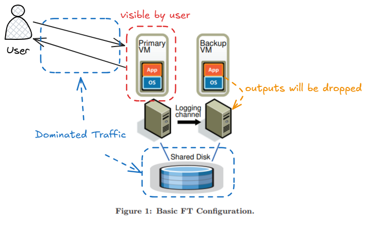
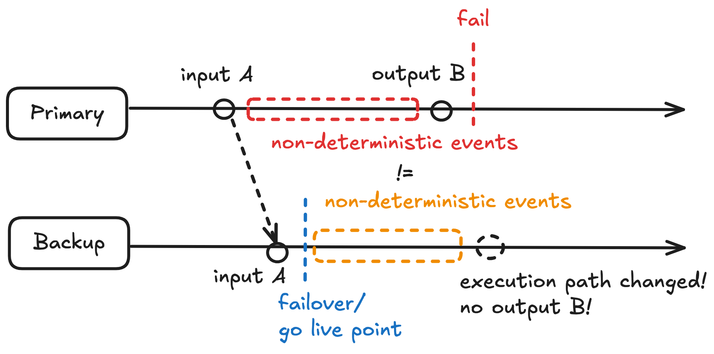
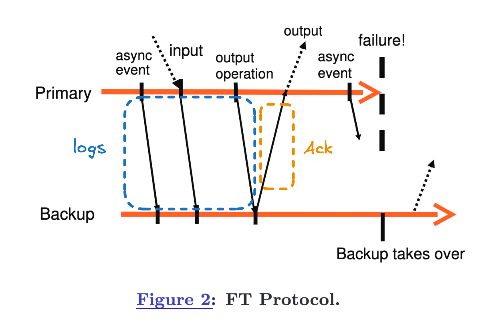
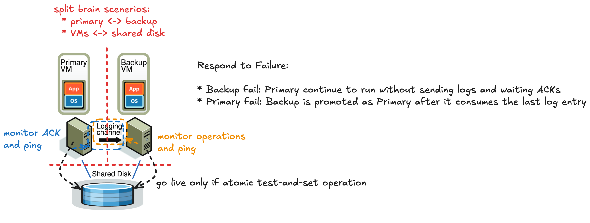
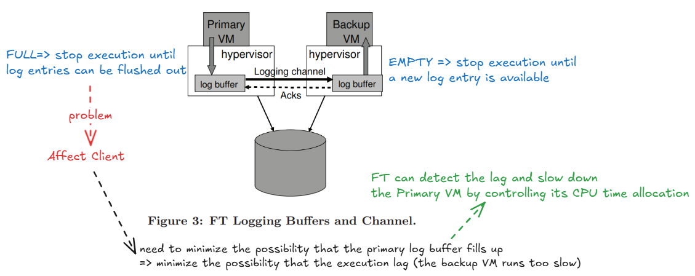

## Key Contributions

* Bressoud and Schneider describe a prototype implementation of fault-tolerant VMs for the HP PA-RISC platform. 
* They have made some fundamental changes for **performance reasons** and investigated a number of **design alternatives**. 
    * efficient event delivery mechanism
* In addition, we have had to design and implement many additional components in the system and deal with a number of **practical issues** to build a complete system that is efficient and usable by customers running enterprise applications.

## Design Considerations

* Consistency: from external world point of view, primary and backup are "equal"
* Network partition: CP over AP
* Failure Detection and Response
* (Re-)Start FT VMs
* Logging channel flow control

## Basic Fault-Tolerance Design

## Deterministic Replay Implementation

* Deterministic replay records the inputs of a VM and all possible non-determinism associated with the VM execution in a stream of log entries written to a log file.
* For non-deterministic operations, sufficient information is logged to allow the operation to be reproduced with the same state change and output. During replay, the event is delivered at the same point in the instruction stream.

## FT Protocol

Challenge 1: suppose a failure were to happen immediately after the primary executed the output operation and only “go live” (stop replaying and take over as the primary VM) at that point. If the backup were to go live at the point of the last log entry before the output operation, some non-deterministic event might change its execution path before it executed the output operation.

Solution 1: 

1. create a special log entry at each output operation.
1. output rule: primary may not send the output to the external world, until the backup has received and acknowledged the log entry associated with the operation producing the output.

Note: The backup **cannot** determine if a primary crashed immediately before or after sending its last output.

## Detecting and Responding to Failure

## Start and Restart FT VMs

Requirements:

* be able to restart when the primary VM is in arbitrary state
* does not significantly disrupt the execution of primary VM

Start Backup VM:

1. Primary VM reports it needs a backup VM
1. Cluster controller decides which server to run the backup VM
1. FT Protocol: 
    1. Primary VM pauses execution less than second
    1. Clone the Primary VM as Backup VM
    1. Set up logging channel
    1. Primary VM enables logging mode and Backup VM enables replay mode

## Managing the Logging channel

## Operations on FT VMs

* Explicitly powered off: if primary is explicitly powered off, backup should power off as well.

## Implementation Details for Disk IOs

Problem 1: disk operations are non-blocking => can run in parallel => non-determinism
Solution 1: detect I/O race => force them to run sequentially in the same way on primary and backup

Problem 2: disk operations directly access the memory of a VM via DMA => Memory Race can happen
Solution 2: Memory Page Protection using bounce buffer

Problem 3: disk IOs that are outstanding (i.e. not completed) on the primary when a failure happens, and the backup takes over
Solution 3: re-issue the disk IOs on the newly-promoted primary because these operations are idempotent.

## Shared vs Non-Shared Disk

Why non-shared disk?

* long-distance FT
* cons: one more state needs to keep in-sync, the above solution for handling split-brain problem does not work

## Questions

Q. What is the failure mode the system target to deal with?

* Fail-Stop: failure be detected before the failing server causes an incorrect externally visible action

Q. What are the ways of replicating states to backup machine?

* replicate all states (CPU, Memory, I/O devices)
    * cons: need high bandwidth for transfering states from primary to backup
* Sate Machine Approach(Replicate Computation)
    * keep them in sync by letting them receiving the same inputs with same order
    * pros: need less bandwidth, ideal for deterministic state transition and the information for state transition is less than the information for memory update
    * cons: need a way to handle non-deterministic operations (e.g. reading a time of the clock, I/O Interrupt events, random number)

Q. Why is SMR approach suitable for VM?

* VM can be considered as a state machine where all its operation are being virtualized => The hypervisor can capture all non-deterministic operations from the primary and replay them correctly to the backup.
* better physical seperation => primary and backup can run on different physical machine

Q. Whare are the challenges of replicating execution of any VM running any operating system and workload?

1. correctly capturing all the input and non-determinism necessary to ensure deterministic execution of a backup virtual machine
1. correctly applying the inputs and nondeterminism to the backup virtual machine
1. doing in a manner that does not degrade performance

Q. The paper says FT doesn't cope with multi-processor guests. Why not?

In general, the results of software running on multiple processors depends on exactly how the **instruction streams on the processors were interleaved**. For FT to ensure that the backup stays in sync with the primary, it would have to cause the interleaving to be the same on both computers. This turns out to be hard: you can't easily find out what the interleaving is on the primary, and you can't easily control it on either machine.

Q. How can 2 phrase commit help the backup to determine if a primary crashed immediately before or after sending its last output?

Q. What is "an atomic test-and-set operation on the shared storage"?

The system uses a network disk server, shared by both primary and backup (the "shared disk" in Figure 1). That network disk server has a "test-and-set service". The test-and-set service maintains a flag that is initially set to false. If the primary or backup thinks the other server is dead, and thus that it should take over by itself, it first sends a test-and-set operation to the disk server.

The primary (or backup) only takes over ("goes live") if test-and-set returns true.

The higher-level view is that, if the primary and backup lose network contact with each other, we want only one of them to go live. The danger is that, if both are up and the network has failed, both may go live and develop split brain. If only one of the primary or backup can talk to the disk server, then that server alone will go live. But what if both can talk to the disk server? Then the network disk server acts as a tie-breaker; test-and-set returns true only to the first call.

Q. How does VM FT handle network partitions? That is, is it possible that if the primary and the backup end up in different network partitions that the backup will become a primary too and the system will run with two primaries?

VM FT prevent the system will run with two primaries by using a shared disk. Both VMs can talk to the shared disk, or neither can. 
The primary (or backup) only takes over ("goes live") if test-and-set returns true.

Q. Apart from avoiding the primary log buffer become full, What is the reason why we want to minimise execution lag?

If the primary fails, the backup needs to catch up all acknowledged log entries before "go live". The time to finish replaying is basically the execution lag time at the point of the failure, so the time for the backup to go live is roughly equal to the failure detection time plus the current execution lag time.

Q. How do Section 3.4's bounce buffers help avoid races?

The problem arises when a network packet or requested disk block arrives at the primary and needs to be copied into the primary's memory. Without FT, the relevant hardware copies the data into memory while software is executing. Guest instructions could read that memory during the DMA; depending on exact timing, **the guest might see or not see the DMA'd data** (this is the race). It would be bad if the primary and backup both did this, since due to slight timing differences one might read just after the DMA and the other just before. In that case they would diverge.

FT avoids this problem by not copying into guest memory while the primary or backup is executing. FT first copies the network packet or disk block into **a private "bounce buffer" that the primary cannot access** When this first copy completes, the FT hypervisor interrupts the primary so that it is not executing. FT records the point at which it interrupted the primary (as with any interrupt). Then FT copies the bounce buffer into the primary's memory, and after that allows the primary to continue executing. **FT sends the data to the backup on the log channel**. The backup's FT interrupts the backup at the same instruction as the primary was interrupted, copies the data into the backup's memory while the backup is into executing, and then resumes the backup.

The effect is that the network packet or disk block appears at exactly the same time in the primary and backup, so that no matter when they read the memory, both see the same data.

Q. what I find most confusing about the paper?

* how do Section 3.4's bounce buffers help avoid races?
