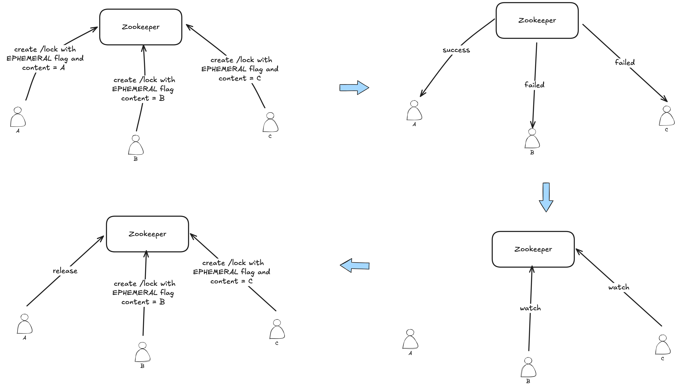
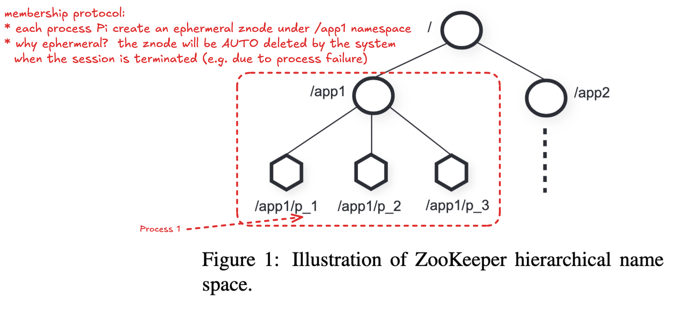
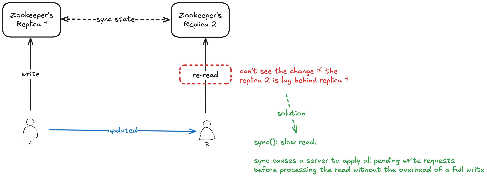

## Novelty

* **Coordination Kernel**: Instead of implementign sepcific coordination needs on the server, Zookeepr expose an API that enables application developers to implement their own primitives.

## Takeaways

?? How the system guarantees(per client of FIFO execution of requests and asynchronous-linerazability) interact
?? Zab: a leader-based atomic broadcast protocol to guarantee that update operations satisfy linearisability 

---

## Assumptions

* Read to Write ratio: 2:1, 100:1
* Only rely on TCP connection. No assumption on the hardware feature/network topology
* Store metadata for coordination purpose instead of general data

## Design Challenges

* How to avoid slow or faulty clients to impact negatively the performance of faster clients?

## Guarantees

1. per client of FIFO execution of requests
2. (asynchronous-)lineraizability of all WRITE requests that change the Zookeeper state
    * this definition of linearizability is different from the one originally proposed by Herlihy
        * a client is only ablue to have one outstanding operation at a time (a client is one thread)
    * client can have multiple outstanding operations
* Section 2.2 explains how these 2 guarantees interact

* the ordering guarantee for the notifications:
    * If a client is watching for a change, the client will see the notification event before it sees the new state of the system after the change is made

* Liveness: if a majority of ZooKeeper servers are active and communicating the service will be available
* Durability: if the ZooKeeper service responds successfully to a change request, that change persists across any number of failures as long as a quorum of servers is eventually able to recover.

## Terminology

* client: a user of the Zookeeper service
* server: process providing the ZooKeeper service
* **znode**: in-memory data node in the ZooKeeper data
* **data tree**: a set of *znode* that is organized in a hierarchical namespace

## Client API

* does not use handles to access znodes. =>
    * no `open` or `close` methods
    * eliminates extra state(e.g. full path of the znode) that the server would need to maintain
* version paramter for conditional update

## Examples of Primitives

### Simple Lock

Problems:

1. It suffers from the herd effect: If there are many clients waiting to acquire a lock, they will all vie for the lock when it is released even though only one client can acquire the lock.
2. it only implements exclusive lockin.

---

## Questions

Q. How is the configuration used for coordination?

* The configuration is a list of operational parameters for the system process that can change dynamically.
* operational parameters: e.g. alive members of the cluster, leader of the cluster, roles of the member, lock owner

Q. What is the meaning of "wait-free"?

A non-blocking algorithm is lock-free if there is guaranteed system-wide progress, and wait-free if there is also guaranteed **per-thread progress**.

Ref: https://en.wikipedia.org/wiki/Non-blocking_algorithm

Q. Why is Zookeeper implemented using a pipelined architecture? What is a pipelined architecture?

Q. Why *data tree*?

* can run 1 Zookeeper for N applications/coordinations
* by allocating subtrees for the namespace of different applications
* and for setting access rights to those subtrees

Q. What is the problem can arise when clients have their own communication channels in addition to ZooKeepeer?

* Consider two clients A and B that have a shared configuration in ZooKeeper and communicate through a shared communication channel.
* If A changes the shared configuration in ZooKeeper and tells B of the change through the shared communication channel, B would expect to see the change when it re-reads the configuration.

Q. One use of Zookeeper is as a fault-tolerant lock service (see the section "Simple locks" on page 6). Why isn't possible for two clients to acquire the same lock? In particular, how does Zookeeper decide if a client has failed and it can give the client's locks to other clients?

---

## Possible Future Study

* How does Kafka use Zookeeper for multiple coordination tasks? Why it choose Zookeeper? What are the implementation challenges? What are the differences between the examples of primitives shown in the paper and Kafka?
