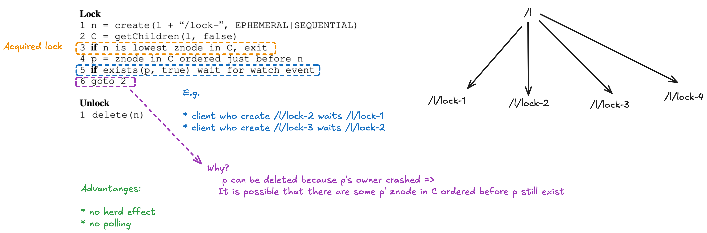
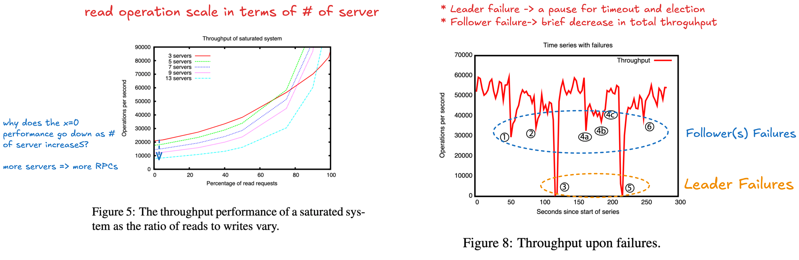

## Novelty

* **Coordination Kernel**: Instead of implementign sepcific coordination needs on the server, Zookeepr expose an API that enables application developers to implement their own primitives.
* High Performance
    * key ideas: asynchronous client requests, read by any replica

## Takeaways

* How to build coordination primitives using Zookeeper weaker consistency API
    * watch, sessions, notifications, write-linearizability 
* How the system guarantees(per client of FIFO execution of requests and asynchronous-linerazability) interact

## Strengths and Weaknesses

+: 

* can implement different coordination primitives using weaker consistency API
* high performance for read
* fault tolerant storage

-:

* reads are not linearisable

---

## Assumptions

* Read to Write ratio: 2:1, 100:1
* Only rely on TCP connection. No assumption on the hardware feature/network topology
* Store metadata for coordination purpose instead of general data

## Design Challenges

* How to avoid slow or faulty clients to impact negatively the performance of faster clients?

## Guarantees

1. per client of FIFO execution of requests
2. (asynchronous-)lineraizability of all WRITE requests that change the Zookeeper state
    * this definition of linearizability is DIFFERENT from the one originally proposed by Herlihy
        * a client is only able to have one outstanding operation at a time (a client is one thread)
    * client can have multiple outstanding operations
    * READ operation: 
        * observe the last write from the same client
        * observe the prefix of the log from other clients
        * => stale data
        * no reads from the past (the prefix length never decrease)

* Section 2.2 explains how these 2 guarantees interact

* the ordering guarantee for the notifications:
    * If a client is watching for a change, the client will see the notification event BEFORE it sees the new state of the system after the change is made

* MIT DS Lecture 9 Zookeeper explains the guarantees in details: https://www.youtube.com/watch?v=HYTDDLo2vSE

* Liveness: if a majority of ZooKeeper servers are active and communicating the service will be available
* Durability: if the ZooKeeper service responds successfully to a change request, that change persists across any number of failures as long as a quorum of servers is eventually able to recover.

## Terminology

* client: a user of the Zookeeper service
* server: process providing the ZooKeeper service
* **znode**: in-memory data node in the ZooKeeper data
* **data tree**: a set of *znode* that is organized in a hierarchical namespace

## Client API

* does not use handles to access znodes. =>
    * no `open` or `close` methods
    * eliminates extra state(e.g. full path of the znode) that the server would need to maintain
* version paramter for conditional update

Watch Flag:

The paper does not tell much about how does the notification guarantee is implemented.

## Examples of Primitives

### Simple Lock

Problems:

1. It suffers from the herd effect: If there are many clients waiting to acquire a lock, they will all vie for the lock when it is released even though only one client can acquire the lock.
2. it only implements exclusive lockin.

Simple Locks without Herd Effect:

## Zookeeper Implementation

TODO

## Evaluation

---

## Questions

Q. How is the configuration used for coordination?

* The configuration is a list of operational parameters for the system process that can change dynamically.
* operational parameters: e.g. alive members of the cluster, leader of the cluster, roles of the member, lock owner

Q. What is the meaning of "wait-free"? Why is Zookeeper "wait-free"?

Wait-free definition: 

A wait-free implementation of a concurrent data object is one that guarantees that any process can complete any operation in a finite number of steps, regardless of the execution speeds of the other processes.

Ref: https://cs.brown.edu/~mph/Herlihy91/p124-herlihy.pdf

Zookeeper is wait-free because it **processes** one client's requests without needing to wait for other clients to take action. This is partially a consequence of the API: despite being designed to support client/client coordination and synchronization, **no ZooKeeper API call is defined in a way that would require one client to wait for another**.

However, ZooKeeper **clients** often need to wait for each other, with watches or polling. The main effect of wait-freedom on the API is that watches are factored out from other operations. The combination of atomic test-and-set updates (e.g. file creation and writes conditional on version) with watches allows clients to synthesize more complex blocking abstractions (e.g. Section 2.4's locks and barriers).

Q. What are the examples of not "wait-free" system?

A system that provided a **lock acquire operation** that **waited for the current lock holder to release the lock** would not be wait-free

Q. What is a pipelined architecture? Why is Zookeeper implemented using a pipelined architecture? 

Q. Why *data tree*?

* can run 1 Zookeeper for N applications/coordinations
* by allocating subtrees for the namespace of different applications
* and for setting access rights to those subtrees

Q. What is the problem can arise when clients have their own communication channels in addition to ZooKeepeer?

* Consider two clients A and B that have a shared configuration in ZooKeeper and communicate through a shared communication channel.
* If A changes the shared configuration in ZooKeeper and tells B of the change through the shared communication channel, B would expect to see the change when it re-reads the configuration.

Q. One use of Zookeeper is as a fault-tolerant lock service (see the section "Simple locks" on page 6). Why isn't possible for two clients to acquire the same lock? In particular, how does Zookeeper decide if a client has failed and it can give the client's locks to other clients?

* The client who can acquire the lock is the one who can create the znode. Each client will try to create a znode with the **same full path** and such znode only can be created once. Since only one client can create that znode, only one client can acquire the same lock.
* The Zookeeper decide a client has failed if the session has terminated and that znode will be deleted. So other clients create that znode again for acquiring the lock.

Q. Why is *zxid* needed?

* When the replica receives a read request from the client, the replica does not know whether its log contains the last write of the client if the replica does know the *zxid*. So what the replica can do is return the data immediately.
* The client will send the write request to the leader. The leader will return after the write is commited by majority. Thus, some of the replicas may lag behind and the write is not yet included into their logs.
* The client can read data from any replica for performance reason. So, the client can read data from a replica that is lag behind and the client can't observe the data that reflects his last write which violate the read guarantee.
* If the client send the read request with the *zxid* to the replica, the replica can wait its log contains the write command at *zxid* index and apply this write command before return the data.

Q. What's the point of sessions?

* to guarantee FIFO clienter order
* keep track of each client's watch
* to implement the ephemeral znodes by session act as a lease

## TODO

* Read Section 4

---

## Possible Future Study

* How does Kafka use Zookeeper for multiple coordination tasks? Why it choose Zookeeper? What are the implementation challenges? What are the differences between the examples of primitives shown in the paper/Yahoo Message Broker and Kafka?
* Wait-Free Synchronization: https://cs.brown.edu/~mph/Herlihy91/p124-herlihy.pdf
* Compare with other coordination services e.g. etcd
    * https://etcd.io/docs/v3.6/learning/why/
